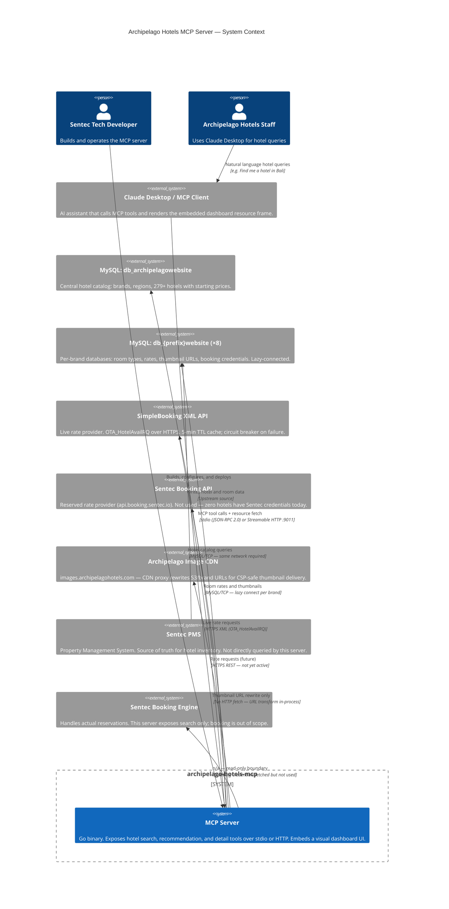
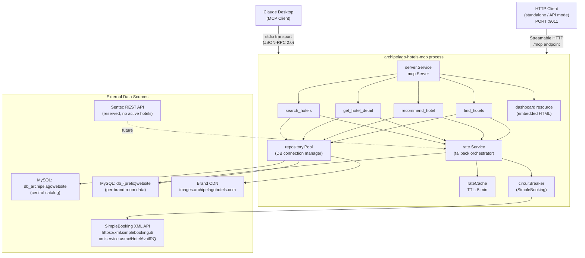

# SYSTEM.md — Archipelago Hotels MCP Server

System context document for AI agents and engineers working on this codebase.

---

## 1. System Purpose

This is an MCP (Model Context Protocol) server written in Go that gives Claude Desktop hotel search, recommendation, and browsing capabilities across the full Archipelago Hotels & Resorts portfolio.

**Operator**: Archipelago Hotels & Resorts  
**Software platform**: Sentec (trademark of Sentinel Tech) — PMS, Booking Engine, EMS  
**Module path**: `github.com/msw/archipelago-hotels-mcp`

### 13 Supported Brands

| Brand | DB Prefix | Tier |
|---|---|---|
| Aston | `aston` | Upscale |
| Grand Aston | `aston` (parent) | Luxury |
| The Alana | `alana` | Upscale |
| Harper | `harper` | Upscale |
| NEO | `neo` | Midscale |
| favehotels | `favehotel` | Budget |
| Kamuela | `kamuela` | Upscale |
| Huxley | `huxley` | Lifestyle |
| Quest | `quest` | Budget/Extended-stay |
| PBA | `pba` | see `brandDBName` |
| Nordic | `nordic` | Midscale |
| Four Corners | `fourcorners` | Midscale |

> Sub-brands resolve to the parent brand's DB prefix via `Pool.BrandPrefix()`.

---

## 2. System Context



---

## 3. Architecture Diagram



---

## 3. Data Flow: `search_hotels` Tool Call

```mermaid
sequenceDiagram
    participant CD as Claude Desktop
    participant MCP as MCP Server
    participant REPO as repository.Pool
    participant RATE as rate.Service
    participant CENTRAL as db_archipelagowebsite
    participant BRAND as db_{prefix}website
    participant SB as SimpleBooking API
    participant CDN as images.archipelagohotels.com

    CD->>MCP: tool call: search_hotels(city, brand, query)
    MCP->>REPO: SearchHotels(SearchParams)
    REPO->>CENTRAL: SELECT tb_hotels JOIN tb_brands JOIN tb_region\nWHERE hotel_status=1 AND region_name LIKE ?
    CENTRAL-->>REPO: []HotelRow (hotel_id, api_hotel_id, db_prefix, starting_price…)
    REPO-->>MCP: hotels list

    par Parallel fan-out (maxWorkers=5)
        MCP->>RATE: BatchMinRates(hotels)
        loop per hotel with api_hotel_id
            RATE->>RATE: check rateCache (TTL 5 min)
            alt cache miss
                RATE->>BRAND: GetCredentials(prefix, api_hotel_id)
                BRAND-->>RATE: BrandCredentials (SimpleBookingUser, SBPass, SBID)
                alt SB creds valid AND circuit breaker closed
                    RATE->>SB: HotelAvailRQ XML (StartDate, EndDate, HotelCode)
                    SB-->>RATE: XML room list with AmountAfterTax
                    RATE->>RATE: cache result; source="simplebooking"
                else SB unavailable
                    RATE->>BRAND: SELECT room_rate FROM tb_hrooms WHERE hotel_id=?
                    BRAND-->>RATE: stored rates; source="stored"
                else no brand rates
                    RATE-->>MCP: use hotel_starting_price; source="starting_price"
                end
            end
            RATE-->>MCP: minRate[hotelID]
        end

        MCP->>REPO: GetThumbnails(hotels)
        loop per brand prefix
            REPO->>BRAND: SELECT hotel_id, thumbnail_desktop FROM tb_hotels WHERE hotel_id IN (…)
            BRAND-->>REPO: CDN URL (e.g. s3.amazonaws.com/…)
            REPO->>REPO: resizeImageURL() → images.archipelagohotels.com/{bucket}/{path}
        end
        REPO-->>MCP: thumbMap[hotelID]
    end

    MCP->>MCP: merge: priceFrom = rateMap[id] ?? starting_price\nderiveTags(hotel)
    MCP-->>CD: searchResult{hotels: []hotelSummary, total, filtered, city}
    Note over CD: UI renders hotel cards\nvia resourceUri (dashboard HTML)
```

---

## 4. Transport Modes

| Mode | Command | Endpoint | Use Case |
|---|---|---|---|
| **stdio** | `archipelago-hotels-mcp stdio` | stdin/stdout | Claude Desktop integration, Pi Agent |
| **HTTP** | `archipelago-hotels-mcp http` | `POST/GET /mcp` (default `:9011`) | Standalone API, CI testing, web clients |

### HTTP Mode Additional Endpoints

| Path | Method | Description |
|---|---|---|
| `/mcp` | POST, GET | MCP Streamable HTTP transport |
| `/dashboard` | GET | Standalone visual hotel dashboard (embedded HTML) |
| `/api/hotels` | GET | `?city=&brand=` — JSON hotel list |
| `/api/brands` | GET | Unique brand names |
| `/api/regions` | GET | Distinct region names |
| `/health` | GET | `{status, version, db}` health check |

CORS is open (`Access-Control-Allow-Origin: *`) in HTTP mode. Custom port via `-addr :PORT`; debug logging via `-verbose`.

---

## 5. Tool Registry

| Tool Name | Visibility | Description | Meta Flags |
|---|---|---|---|
| `search_hotels` | agent + app | Priority tool: search by city, country, brand, or free-text. Triggers on any hotel/accommodation query. Returns up to 50 hotels with live pricing. | `resourceUri`, `resourceDomains: ["images.archipelagohotels.com"]` |
| `get_hotel_detail` | app only | Full detail for one hotel including room types, amenities, coordinates. Called by the dashboard UI, hidden from Claude's tool picker. | `resourceUri`, `visibility: ["app"]` |
| `recommend_hotel` | agent + app | Priority tool: ranked recommendations by vibe (luxury, romantic, business, family, nature, budget), budget tier, and trip purpose. Returns up to 50 scored hotels. | `resourceUri`, `resourceDomains: ["images.archipelagohotels.com"]` |
| `find_hotels` | agent + app | Priority tool: browse/book the full portfolio, optionally filtered by city or brand. Returns up to 200 hotels for the visual dashboard. | `resourceUri`, `resourceDomains: ["images.archipelagohotels.com"]` |

Tools are registered in `internal/tools/` — one file per tool. The DB pool and rate service are injected at registration time, not stored globally.

The MCP resource registered at `resources.ResourceURI` serves the embedded dashboard HTML used as the tool UI frame.

---

## 6. Database Topology

### Central Database

**Name**: `db_archipelagowebsite` (env: `MYSQL_DB`)

Key tables queried:

| Table | Purpose |
|---|---|
| `tb_hotels` | Hotel catalog: `hotel_id`, `api_hotel_id`, `brand_id`, `hotel_name`, `hotel_address`, `hotel_status`, `hotel_rating`, `hotel_starting_price`, `hotel_currency`, `latitude`, `longtitude` |
| `tb_brands` | Brand metadata: `brand_id`, `brand_name`, `db_prefix_name`, `parent_brand_id`, `brand_color` |
| `tb_region` | Geographic regions: `region_id`, `region_name` |

All hotel queries filter `WHERE hotel_status = 1`. The central DB is queried for catalog data only; pricing is never stored here as authoritative.

> Note: `tb_hotels.longtitude` has a typo in the production schema (double `t`) — the codebase matches it exactly.

### Per-Brand Databases

**Pattern**: `db_{prefix}website`

Exceptions (see `brandDBName` map in `repository.go`):

| Prefix | Actual DB Name |
|---|---|
| `favehotel` | `db_favewebsite` |
| `pba` | `db_pba` |

Key tables queried per brand:

| Table | Purpose |
|---|---|
| `tb_hotels` | `hotel_id` (= `api_hotel_id` from central), `thumbnail_desktop` (CDN URL) |
| `tb_hrooms` / `tb_hroom` | Room types: `room_name`, `room_rate`, `simplebooking_id`, `sentec_id` |
| (booking credentials) | `simplebooking_id`, `simplebooking_user`, `simplebooking_pass`, `xml_user`, `xml_pass`, `hotel_channel`, `sentec_booking_id` |

Per-brand connections are **lazily opened** on first use and cached. Column presence is scanned via `INFORMATION_SCHEMA.COLUMNS` on connect because schema varies across brands (`tb_hrooms` vs `tb_hroom`, optional columns).

Connection limits: central = 10 max open / 3 idle; per-brand = 3 max open / 1 idle. All connections use `ConnMaxLifetime: 5 min`.

### Environment Variables

| Variable | Default | Description |
|---|---|---|
| `MYSQL_HOST` | `127.0.0.1` | MySQL host |
| `MYSQL_PORT` | `3306` | MySQL port |
| `MYSQL_USER` | `root` | MySQL user |
| `MYSQL_PASS` | `` | MySQL password |
| `MYSQL_DB` | `db_archipelagowebsite` | Central database name |
| `DEBUG` | `0` | Set to `1` for debug-level slog output |
| `url_image_resizer` | `https://images.archipelagohotels.com/` | Image CDN base URL |

---

## 7. Rate Service Fallback Chain

The `rate.Service` always attempts sources in order, stopping at the first success:

```
1. SimpleBooking live XML API
   - Requires: BrandCredentials with SimpleBookingID > 0 AND non-empty user/pass
   - Circuit breaker: opens after 5 consecutive failures; resets after 120 s cooldown
   - Result source label: "simplebooking"

2. Stored tb_hrooms.room_rate (per-brand DB)
   - Used when: SB credentials absent, SB API error, or circuit breaker open
   - Filters: room_rate > 0
   - Result source label: "stored"

3. hotel_starting_price (central DB)
   - Used when: no brand DB, no rooms, or all room_rate = 0
   - Value from HotelRow.StartingPrice populated at search time
   - Result source label: "starting_price"
```

Results are cached per `(dbPrefix, apiHotelID)` key with a **5-minute TTL**. The cache prevents repeated API calls during a single conversation session.

`BatchMinRates` fans out across all hotels using a **bounded goroutine pool of 5 workers**, returning the minimum rate per hotel. If a hotel has no `api_hotel_id` or no `db_prefix`, it is excluded from the rate lookup and its `starting_price` is used directly in the tool handler.

---

## 8. Image Pipeline

```
Brand CDN URL (from tb_hotels.thumbnail_desktop in brand DB)
    e.g. https://s3.amazonaws.com/sentineltech-publicwebsite/uploads/photo.jpg
         https://cdn.astonhotels.com/images/hotel/thumb.jpg

        ↓  resizeImageURL(url, width=0, height=0, location="center")

Rewritten URL → images.archipelagohotels.com/{bucket}/{path}
    e.g. https://images.archipelagohotels.com/sentineltech-publicwebsite/uploads/photo.jpg
         https://images.archipelagohotels.com/astonhotels/images/hotel/thumb.jpg
```

### Bucket Name Resolution

| Source domain pattern | Bucket name |
|---|---|
| `sentineltech.*` | `sentineltech-publicwebsite` (hardcoded) |
| `{sub}.{bucket}.com/…` | `{bucket}` (second dot-segment) |

The function strips the original `{sub}.{bucket}.com/` prefix and rebuilds the URL as `{imageResizerBase}/{bucket}/{remaining_path}`.

When `width` and `height` are both 0 (the current usage), no resize query params are appended — only the CDN domain is rewritten. Optional params: `?s={width}` (width only), `?d={W}x{H}` (both dimensions), `?location={center|top|…}`.

---

## 9. CSP Allowlist

The MCP protocol requires tools that render external images to declare their allowed domains in tool `Meta`. This enables the client (Claude Desktop) to apply an appropriate Content Security Policy for the embedded resource frame.

Every user-visible tool declares:

```go
Meta: mcp.Meta{
    "ui": map[string]any{
        "resourceUri":     resources.ResourceURI,
        "resourceDomains": []string{"images.archipelagohotels.com"},
    },
},
```

`get_hotel_detail` is app-only (hidden from Claude's tool list) and does not include `resourceDomains` because it is invoked by the dashboard JS, not by Claude directly.

The dashboard HTML resource itself is embedded at compile time from `internal/resources/mcp-app.html` (served via `resources.DashboardHTML()`). The resource URI constant (`resources.ResourceURI`) is the stable identifier linking tool calls to their display frame.

---

## 10. Known Constraints and Limitations

| Area | Constraint |
|---|---|
| **Sentec API** | Integrated in `internal/rate/sentec.go` but zero hotels currently have Sentec credentials. The fallback chain skips it silently. Treat as reserved for future use. |
| **Schema drift** | Per-brand DBs have inconsistent schemas. Some use `tb_hrooms`, others `tb_hroom`. Column presence is probed via `INFORMATION_SCHEMA` at connect time (`Pool.HasColumn`). |
| **Star ratings** | `hotel_stars` column does not exist in the central DB. Stars are derived from `hotel_rating` using a threshold heuristic (≥9.0 → 5 stars, etc.). |
| **`longtitude` typo** | The production column name in `tb_hotels` is `longtitude` (misspelled). The Go scan matches this exactly. Do not correct it in queries without a DB migration. |
| **Country scope** | `SearchParams.Country` defaults to `"Indonesia"`. Non-Indonesia filtering appends a `region_name LIKE ?` clause, but most hotel data is Indonesian. International properties (KL, Tokyo) appear via region match. |
| **Image size limit** | `GetThumbnails` silently omits images — there is no enforced byte limit in the current implementation. The comment referencing 200 KB is aspirational; actual filtering is absent. |
| **Rate cache scope** | The in-process `rateCache` is per-process and does not survive restart. In HTTP mode with multiple instances, each instance maintains its own cache. |
| **Parallel rate fetch** | `BatchMinRates` uses a hard cap of 5 goroutines. For `find_hotels` returning up to 200 hotels, this means ~40 serial batches if all hotels need live rates. Expect 5–15 s response time for full portfolio queries when SB is live. |
| **No booking flow** | The server exposes hotel search and recommendation only. Booking is handled externally by the Sentec Booking Engine. The `hotel_channel` and `SentecBookingID` credentials are fetched but not acted upon by this server. |
| **stdio stderr** | In stdio mode, all `slog` output goes to `os.Stderr`. Claude Desktop captures stderr separately from the JSON-RPC stream. Do not write to stdout in stdio mode. |
| **DB degraded mode** | If the central DB is unreachable at startup, the server continues in degraded mode. All tool calls will return errors, but the process does not exit. |
