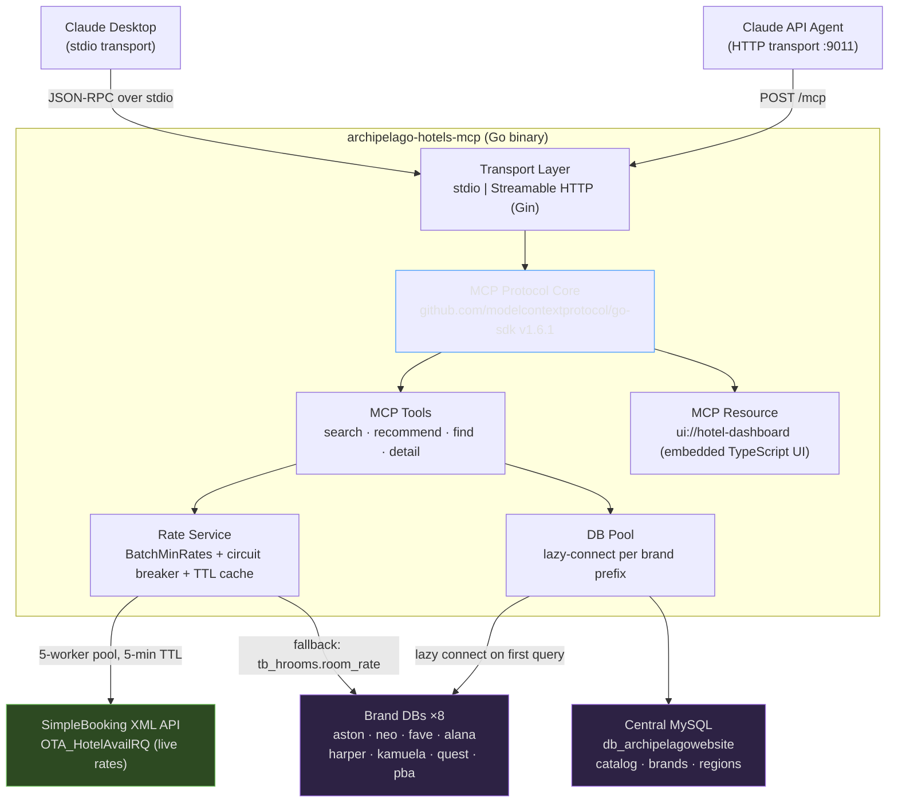

# archipelago-hotels-mcp

> **Model Context Protocol server for Archipelago Hotels & Resorts**
> A [Sentec Tech](https://sentectech.com) product · Built with Go · 279+ hotels · 13 brands

---

## Overview

`archipelago-hotels-mcp` is a production-grade MCP server that exposes Archipelago Hotels & Resorts inventory to AI assistants (Claude Desktop, Claude API agents). It searches, filters, and recommends hotels across 13 brands and 279+ properties in Indonesia, returning live room rates sourced from the SimpleBooking XML API with a two-tier database fallback. A self-contained TypeScript UI is embedded directly in the binary and served as an MCP App resource, letting Claude surface an interactive hotel-browsing dashboard without any external hosting.

---

## Documentation

This project follows the [Diátaxis](https://diataxis.fr) framework.

| Section | Contents |
|---------|----------|
| [Tutorials](./tutorials/) | Step-by-step walkthroughs — build and run your first query |
| [How-To Guides](./how-to/) | Task-oriented recipes — add a brand, configure rate fallback, deploy HTTP mode |
| [Explanation](./explanation/) | Conceptual background — rate fallback design, multi-DB pool, CSP-safe thumbnails |
| [Reference](./reference/) | Exhaustive technical spec — tools, env vars, HTTP endpoints, DB schema |
| [ADRs](./adr/) | Architecture Decision Records — why Go, lazy DB pool, Gin transport, MCP Apps |

---

## Quick Start

```bash
# 1. Clone and enter the repository
git clone https://github.com/archipelago-hotels/archipelago-hotels-mcp.git
cd archipelago-hotels-mcp

# 2. Build UI assets then compile the binary
make build

# 3. Add to Claude Desktop  (~/Library/Application Support/Claude/claude_desktop_config.json)
```

```jsonc
{
  "mcpServers": {
    "archipelago-hotels": {
      "command": "/path/to/archipelago-hotels-mcp",
      "env": {
        "MYSQL_HOST": "127.0.0.1",
        "MYSQL_USER": "root",
        "MYSQL_PASS": "secret",
        "MYSQL_DB":   "db_archipelagowebsite"
      }
    }
  }
}
```

Restart Claude Desktop. Ask: _"Find me a beachfront hotel in Bali under USD 150."_

---

## System Architecture



### Rate Fallback Chain

```
SimpleBooking XML API (live)
        │  failure / timeout
        ▼
tb_hrooms.room_rate  (per-brand DB)
        │  missing
        ▼
hotel_starting_price (central DB)
```

---

## MCP Tools

| Tool | Visibility | Description |
|------|-----------|-------------|
| `search_hotels` | public | Search by city, brand, or free-text query; returns hotel list with current prices |
| `recommend_hotel` | public | Rank hotels against a vibe, budget, or travel purpose using scoring heuristics |
| `find_hotels` | public | Browse all hotels with optional city and brand filters; entry point for listings |
| `get_hotel_detail` | app-only | Return full hotel detail with room types and rates; called exclusively by the embedded UI |

> **Note:** `get_hotel_detail` has `visibility: app` — it is registered for MCP App resource calls only and is not surfaced to the LLM directly.

---

## Environment Variables

| Variable | Default | Required | Purpose |
|----------|---------|----------|---------|
| `MYSQL_HOST` | `127.0.0.1` | No | Database server hostname or IP |
| `MYSQL_PORT` | `3306` | No | Database server port |
| `MYSQL_USER` | `root` | No | Database username |
| `MYSQL_PASS` | *(empty)* | No | Database password |
| `MYSQL_DB` | `db_archipelagowebsite` | No | Central database name |
| `DEBUG` | `0` | No | Set to `1` to enable verbose debug logging |
| `url_image_resizer` | `https://images.archipelagohotels.com/` | No | Image CDN proxy base URL for thumbnail rewriting |

---

## HTTP Endpoints (HTTP Mode)

Start with `make dev-http` or run the binary with `--http`.

| Method | Path | Description |
|--------|------|-------------|
| `POST` / `GET` | `/mcp` | MCP Streamable HTTP transport |
| `GET` | `/dashboard` | Standalone HTML hotel dashboard |
| `GET` | `/api/hotels` | JSON hotel list (`?city=&brand=` optional) |
| `GET` | `/api/brands` | JSON list of all brands |
| `GET` | `/api/regions` | JSON list of all regions |
| `GET` | `/health` | Health check: `{ status, version, db }` |

---

## Brands

| Brand | DB Prefix | Notes |
|-------|-----------|-------|
| Aston | `aston` | |
| Grand Aston | `aston` | Shares Aston prefix |
| The Alana | `alana` | |
| favehotels | `fave` | |
| Hotel Neo | `neo` | |
| Kamuela Villas | `kamuela` | |
| Quest Hotels | `quest` | |
| Harper | `harper` | |
| Huxley | *(central)* | |
| Nordic | *(central)* | |
| Four Corners | *(central)* | |
| PBA | `pba` | Uses `tb_hroom` (singular), different status column |

---

## Development

```bash
make build-ui    # compile TypeScript UI via Vite → embeds into binary
make build-go    # compile Go binary
make build       # both (build-ui then build-go)
make dev-http    # run server in HTTP mode on :9011 with hot reload
```

**Key source files:**

```
cmd/archipelago-hotels-mcp/main.go   entrypoint, transport dispatch
internal/server/server.go            MCP server wiring + HTTP routes (Gin)
internal/repository/repository.go   Pool, Config, HotelRow, BrandRow, RoomRow
internal/repository/hotel.go        SearchHotels, GetHotelByID, thumbnails
internal/repository/room.go         GetRooms (schema-adaptive), GetCredentials
internal/rate/rate.go               Service, BatchMinRates, circuit breaker
internal/rate/cache.go              rateCache (TTL, lazy expiry)
internal/rate/simplebooking.go      XML builder + parser for SB API
internal/tools/search.go            search_hotels handler
internal/tools/recommend.go         recommend_hotel handler
internal/tools/dashboard.go         find_hotels handler
internal/tools/detail.go            get_hotel_detail handler (app-only)
internal/resources/dashboard.go     MCP resource registration
ui/src/mcp-app.ts                   TypeScript frontend (single file, 1200+ lines)
```

---

## Architecture Decisions

See [`docs/adr/`](./adr/) for the full decision log. Summary:

| # | Decision |
|---|----------|
| ADR-1 | Go + go-sdk for MCP (not Node.js) — type safety, single binary, no runtime deps |
| ADR-2 | Multi-DB Pool with lazy connect — isolates brand schemas without idle connections |
| ADR-3 | Rate fallback chain (SB → stored → starting_price) — resilience over accuracy |
| ADR-4 | Gin for HTTP transport — minimal overhead, familiar middleware model |
| ADR-5 | MCP Apps ext-apps protocol for embedded UI — no external hosting required |
| ADR-6 | `resizeImageURL` for CSP-safe thumbnails — avoids base64 proxy round-trip |
| ADR-7 | Raw `hotel_currency` code (not hardcoded symbol map) — supports all currencies |

---

## Stack

- **Language:** Go 1.25
- **MCP SDK:** `github.com/modelcontextprotocol/go-sdk` v1.6.1
- **HTTP:** Gin v1.11.0, port `:9011`
- **Database:** MySQL — central `db_archipelagowebsite` + 8 per-brand DBs
- **Frontend:** Vite + TypeScript, compiled and embedded via `//go:embed`
- **Rate source:** SimpleBooking XML API (`OTA_HotelAvailRQ`)

---

<div align="center">

**archipelago-hotels-mcp** is built for [Archipelago Hotels & Resorts](https://archipelagohotels.com)

</div>
