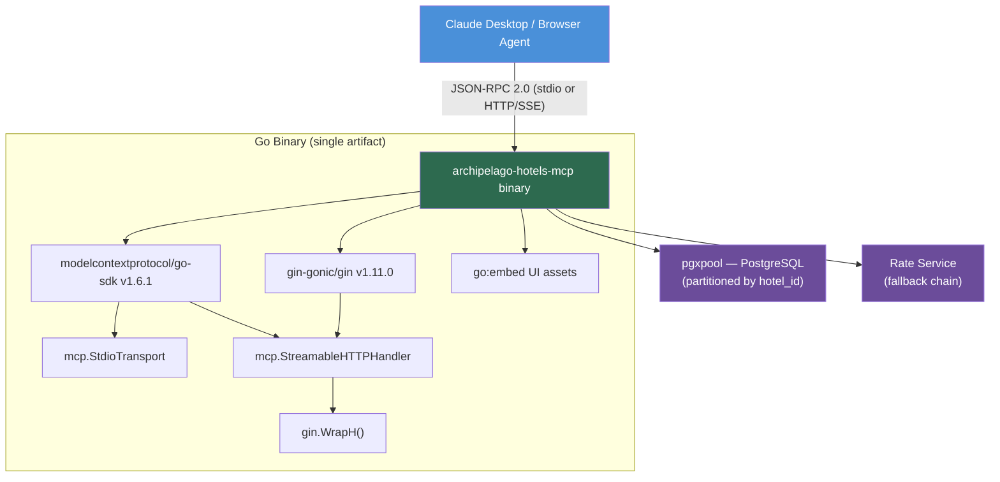

# ADR-0001: Use Go with modelcontextprotocol/go-sdk for MCP Server

- **Status**: Accepted
- **Date**: 2025-06
- **Deciders**: Public Website Team

---

## Context

Archipelago Hotels required an MCP (Model Context Protocol) server capable of hotel search and recommendation, suitable for use with Claude Desktop (stdio transport) and browser-based agents (HTTP/SSE transport). Three language ecosystems were evaluated for implementation:

- **Go** — strong concurrency model, single binary deployment, existing monorepo toolchain
- **Python** — largest body of MCP examples and ML tooling ecosystem
- **TypeScript/Node.js** — richest MCP SDK ecosystem, broad community adoption

Within Go, two MCP SDK approaches were considered: the official `modelcontextprotocol/go-sdk` and a hand-rolled JSON-RPC 2.0 implementation.

Key constraints driving the decision:

1. The server must ship as a self-contained binary with no runtime installed on the deployment target.
2. Tool input schemas must be strongly typed to catch contract errors at compile time.
3. The service must handle concurrent database access across multiple hotel properties (partitioned by `hotel_id` in PostgreSQL).
4. An embedded UI dashboard (HTML/CSS/JS) must be served directly from the binary.
5. The project lives inside the `go-adk-q` monorepo, which is already a Go workspace.

---

## Decision

**Use Go 1.25 with `github.com/modelcontextprotocol/go-sdk` v1.6.1 and `github.com/gin-gonic/gin` v1.11.0 as the HTTP transport layer.**

The official MCP Go SDK provides type-safe generic tool registration (`mcp.AddTool[TArgs, TResult]()`), built-in stdio and streamable-HTTP transports, and structured content support — all of which align with the constraints above without requiring custom protocol work.

---

## Dependency Stack

---

## Consequences

### Positive

- **Single binary deployment**: `go build` produces one self-contained executable (~23 MB including embedded UI); no Go runtime, no Node.js, no Python interpreter required on the host.
- **Strong typing for tool schemas**: `mcp.AddTool[TArgs, TResult]()` uses Go generics — the SDK deserialises JSON input directly into a typed struct, catching schema mismatches at compile time rather than at runtime.
- **Concurrent database access**: Go goroutines and `pgxpool` allow the server to fan out queries across hotel partitions efficiently; the MCP SDK's handler model is goroutine-safe by design.
- **Embedded UI assets**: `go:embed` bundles the dashboard HTML/CSS/JS at compile time; the MCP resource handler serves them without a separate file server or CDN dependency.
- **Monorepo alignment**: The project shares the `go-adk-q` workspace's Go toolchain, `Makefile` targets, and CI pipeline without additional language runtimes.
- **Dual transport from one binary**: The same `*mcp.Server` instance is exposed over stdio (for Claude Desktop) and HTTP/SSE (for browser agents) by wrapping `mcp.NewStreamableHTTPHandler` with `gin.WrapH`.

### Negative

- **Smaller MCP tooling ecosystem vs TypeScript**: The TypeScript MCP SDK has more community-maintained examples, middleware, and third-party integrations. Go SDK documentation and examples are thinner.
- **Verbose schema definitions**: JSON input schemas must be written as `map[string]any` literals in Go; TypeScript and Python alternatives offer decorator or Zod-based schema generation that is more ergonomic.
- **No reflection-based auto-registration**: Unlike some Python MCP frameworks that introspect function signatures, Go requires explicit `mcp.AddTool` calls per handler.

---

## Alternatives Considered

### Python (`modelcontextprotocol` Python SDK)

| Factor | Assessment |
|--------|-----------|
| MCP examples | Most abundant; reference implementations are Python-first |
| Startup time | Slower (interpreter initialisation); unsuitable for low-latency stdio launch from Claude Desktop |
| Deployment | Requires Python runtime + `pip` dependencies on host; no single-binary option without PyInstaller complexity |
| Concurrency | GIL limits true parallel DB access without multiprocessing overhead |
| Monorepo fit | Adds a second language runtime to a Go workspace |

**Rejected**: runtime dependency and deployment complexity outweigh the richer example base.

### TypeScript / Node.js (`@modelcontextprotocol/sdk`)

| Factor | Assessment |
|--------|-----------|
| MCP ecosystem | Richest; most third-party tooling targets this SDK |
| Deployment artifact | Requires Node.js runtime; `node_modules` bundle is large; no native binary |
| Type safety | TypeScript provides compile-time safety comparable to Go generics |
| Concurrency | Event-loop model; concurrent DB access requires care with connection pools |
| Monorepo fit | Introduces npm/pnpm toolchain alongside Go workspace |

**Rejected**: deployment artifact size and runtime dependency conflict with the single-binary requirement.

### Hand-rolled JSON-RPC 2.0 (no SDK)

**Rejected**: re-implementing the MCP protocol (initialization, capability negotiation, tool dispatch, SSE framing) is high-effort, error-prone, and bypasses future SDK improvements (e.g., resumability, batching).
