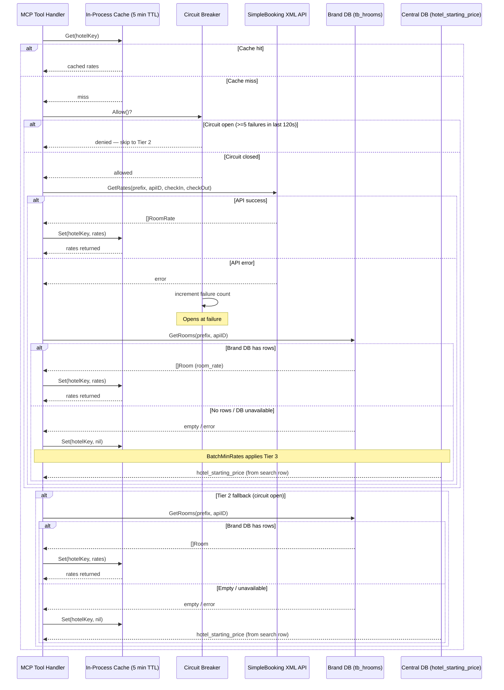

# ADR-0002: Multi-Source Room Rate Fallback Chain

**Status:** Accepted
**Date:** 2025-06
**Files:** `internal/rate/rate.go`, `internal/rate/simplebooking.go`, `internal/rate/cache.go`

---

## Context

Archipelago Hotels & Resorts operates properties across multiple brands, each with a different level of integration with central booking infrastructure:

- **Fully integrated hotels** have live room availability and pricing from SimpleBooking, an XML-based third-party booking engine exposed over HTTP.
- **Partially integrated hotels** have room records in their per-brand MySQL database (`tb_hrooms.room_rate`) but are not connected to SimpleBooking.
- **Catalog-only hotels** appear in the central database (`db_archipelagowebsite`) with a single `hotel_starting_price` field and no room-level rate data.

The MCP server must surface the best available price for every hotel in a search result set, regardless of which tier of integration that hotel belongs to. Returning a zero or null price is not acceptable — it breaks the display layer and misleads agents and end users.

SimpleBooking is occasionally unreachable due to maintenance windows or transient network failures. Any design that depends on it exclusively will produce blank prices during outages.

---

## Decision

Implement a **three-tier price fallback chain** evaluated in order of data freshness. A cache layer and a circuit breaker protect against redundant and runaway calls to the live API tier.

### Tier overview

| Tier | Source | Freshness | Coverage | Query complexity |
|------|--------|-----------|----------|-----------------|
| 1 | SimpleBooking XML API (live) | Real-time (cached 5 min) | Hotels with `api_hotel_id` mapped to SimpleBooking | HTTP + XML parse |
| 2 | `tb_hrooms.room_rate` in brand DB | Periodic ETL (hours to days) | Hotels with brand DB connectivity | SQL — brand DB |
| 3 | `hotel_starting_price` in central DB | Manual / infrequent | All hotels in catalog | Already fetched at search time |

Tier 3 data is already present on the hotel record returned by the search query, so it has zero additional query cost when reached as a fallback.

---

## Sequence diagram

---

## Implementation notes

### Cache

An in-process TTL cache (5-minute window, lazy expiry — no background goroutine) sits in front of all three tiers. A `nil` entry is stored deliberately when both Tier 1 and Tier 2 return empty results, to prevent repeated re-queries for hotels that are known to have no room-level rate data.

### Circuit breaker

The SimpleBooking client wraps outbound calls with a simple threshold-and-cooldown circuit breaker:

- **Threshold:** 5 consecutive failures
- **Cooldown:** 120 seconds
- **Reset:** automatic after the cooldown period elapses

When the circuit is open, Tier 1 is skipped entirely and the chain falls through immediately to Tier 2. This prevents a sustained SimpleBooking outage from adding latency to every search result.

### Worker pool

`BatchMinRates` fans out one goroutine per hotel in the result set, bounded by a semaphore channel with `maxWorkers = 5`. This limits peak concurrency against the SimpleBooking XML endpoint and prevents the server from opening an unbounded number of simultaneous brand DB connections.

---

## Known limitations

| Limitation | Detail |
|------------|--------|
| Batch concurrency cap | `maxWorkers = 5` means a result set of 50 hotels requires ~10 sequential waves of API calls. P99 latency for a full 50-hotel batch can reach 3–5 seconds when Tier 1 is healthy but slow. |
| Cache TTL tradeoff | A 5-minute TTL means a guest who checks rates and returns 4 minutes later may see stale pricing. Rates that change mid-session (e.g. last-room availability) will not be reflected until TTL expiry. |
| Nil cache entry persistence | Hotels with no rate data at cache-fill time will not be retried until the TTL expires, even if data becomes available (e.g. a brand DB is restored after a failure). |
| Circuit breaker is per-process | There is no shared circuit-breaker state across server instances. In a multi-replica deployment, each instance opens and closes its own circuit independently. |
| Tier 3 is a single scalar | `hotel_starting_price` is a single "from" price for all room types. It cannot represent room-type variation and is displayed only when no room-level data is available. |
| No currency normalisation at fallback | Tier 1 returns rates in the currency specified by the SimpleBooking contract. Tier 2 and Tier 3 values are stored in whatever currency the brand DB or central DB uses. No conversion is applied; callers must be aware of potential currency heterogeneity. |

---

## Alternatives considered

| Option | Rejected because |
|--------|-----------------|
| Live rates only (Tier 1) | SimpleBooking is occasionally unreachable; outages produce zero-price results across the board |
| Starting price only (Tier 3) | One scalar per hotel cannot represent room-type variation; defeats the purpose of a room-rate tool |
| Redis shared cache | Adds an external runtime dependency for a single-process server; in-memory TTL cache is sufficient for current query volume |
| Retry with backoff instead of circuit breaker | Does not prevent request avalanche during a sustained outage; circuit breaker is the correct pattern for protecting a fragile downstream |
| Unlimited concurrency to SimpleBooking | SimpleBooking's XML API has undocumented rate limits; a burst of 50 parallel requests risks 429 responses, compounding the failure count and holding the circuit open longer |
| Per-brand circuit breakers | Adds complexity without proportional benefit — SimpleBooking outages affect all brands uniformly; a single breaker is easier to reason about and operationally monitor |

---

## Consequences

- Search results always show a price for every hotel in the catalog, at the highest data quality available at query time.
- Operators can observe circuit-breaker state via server logs (`circuit breaker open` / `circuit breaker reset` log lines in `simplebooking.go`).
- Adding a new hotel brand requires no changes to the fallback chain — brand DB connectivity is handled by the lazy pool (see ADR-0002: Multi-DB Pool with Lazy Per-Brand Connections).
- If SimpleBooking changes its XML schema, Tier 1 will begin returning errors and the circuit breaker will open; Tier 2 and Tier 3 will silently absorb the load until the schema parse is fixed.
