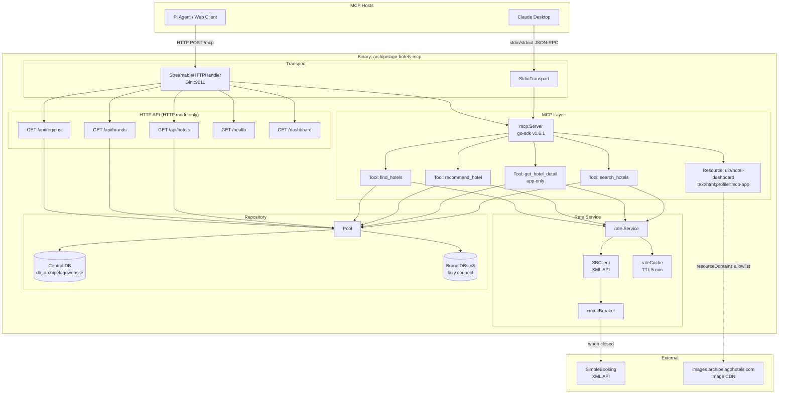
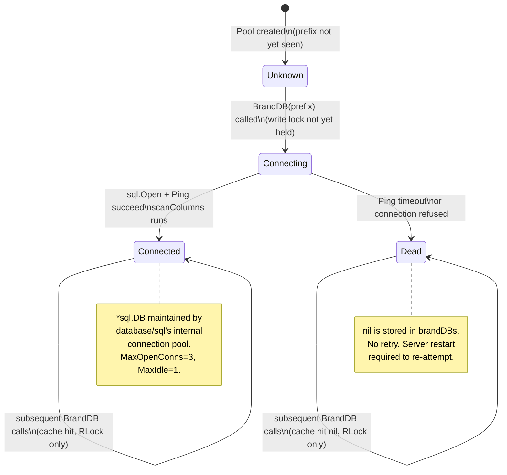
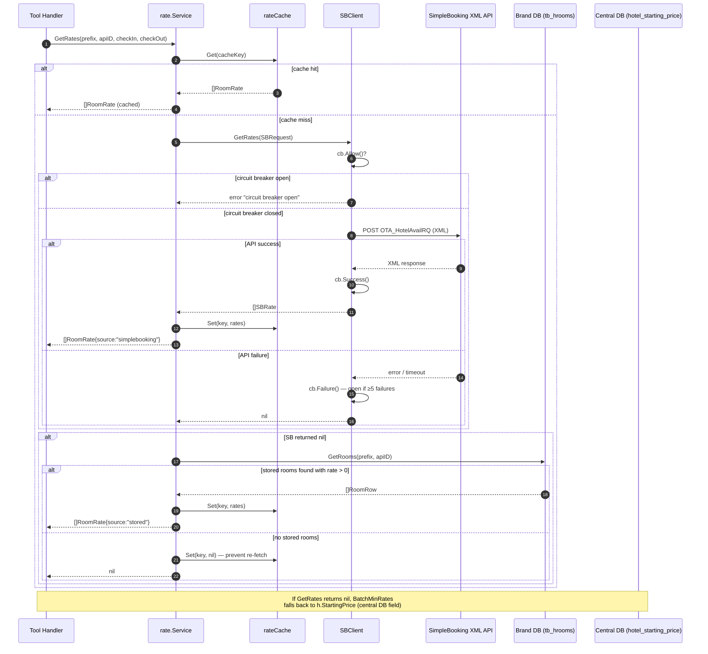

# Architecture: Archipelago Hotels MCP Server

> **Type**: Explanation (Diátaxis — understanding-oriented)
> **Audience**: Engineers onboarding to the codebase, contributors extending it
> **Last reviewed**: 2026-06-22

---

## Table of Contents

1. [What It Is and Why It Exists](#1-what-it-is-and-why-it-exists)
2. [Full Component Diagram](#2-full-component-diagram)
3. [Transport Layer](#3-transport-layer)
4. [MCP Layer](#4-mcp-layer)
5. [Repository Layer](#5-repository-layer)
6. [Rate Service](#6-rate-service)
7. [UI Layer](#7-ui-layer)
8. [Image Handling](#8-image-handling)
9. [Degraded Mode](#9-degraded-mode)

---

## 1. What It Is and Why It Exists

The Archipelago Hotels MCP Server is a **Model Context Protocol (MCP) server** that gives AI agents (Claude Desktop, Pi Agent, or any MCP-capable host) structured access to the Archipelago Hotels & Resorts property catalog. It is a Sentec Tech product — part of the Sentec platform suite.

Without this server an AI model has no way to query live hotel inventory, prices, or room types. It would have to hallucinate or rely on stale training data. The MCP server is the authoritative bridge between the model and the operational databases.

The server has three jobs:

| Job | Mechanism |
|-----|-----------|
| Answer hotel queries from an AI agent | MCP tools (`search_hotels`, `recommend_hotel`, `find_hotels`, `get_hotel_detail`) |
| Render a visual hotel browser inside the AI host | MCP App resource (`ui://hotel-dashboard`) |
| Serve REST endpoints for a standalone web dashboard | HTTP routes via Gin (`/api/*`, `/dashboard`) |

The server is a single compiled Go binary. The same binary handles both the Claude Desktop (stdio) and browser/HTTP use cases — mode is selected by a positional CLI argument.

---

## 2. Full Component Diagram



---

## 3. Transport Layer

The server supports two transports, selected at startup by the first CLI argument.

### 3.1 stdio (`archipelago-hotels-mcp stdio`)

Used with **Claude Desktop** and any agent that spawns the binary as a child process.

The go-sdk `StdioTransport` wraps `os.Stdin` / `os.Stdout` as a JSON-RPC 2.0 channel. Each MCP message is a newline-delimited JSON object. All application logs (`slog`) are written to `stderr` so they do not corrupt the protocol stream.

This mode has zero network setup: Claude Desktop's `claude_desktop_config.json` points to the binary path and arguments; the OS pipe is the transport.

### 3.2 Streamable HTTP (`archipelago-hotels-mcp http`)

Used with browser-based agents, CI tooling, and the standalone web dashboard. Gin listens on `:9011` by default.

The go-sdk `StreamableHTTPHandler` implements the [MCP Streamable HTTP](https://spec.modelcontextprotocol.io/specification/basic/transports/#streamable-http) transport. It accepts both `POST /mcp` (client-initiated requests) and `GET /mcp` (server-sent events for server-initiated messages). Session affinity is carried by the `Mcp-Session-Id` header.

CORS is configured to accept `*` origin with `Content-Type`, `Mcp-Session-Id`, and `Authorization` headers, because browser-based AI hosts and the standalone dashboard originate from different hosts.

### Why both?

| Concern | stdio | HTTP |
|---------|-------|------|
| Latency | None (IPC) | Network round-trip |
| Setup | Zero — Claude Desktop manages lifecycle | Requires a running process |
| Multi-client | One client (the desktop app) | Many concurrent clients |
| Dashboard | Not applicable | `/dashboard` served from same process |
| Production deployment | N/A | Docker / systemd on a VPS |

The binary does not try to auto-detect; the operator chooses explicitly. This avoids hidden coupling between deployment environment and server behaviour.

---

## 4. MCP Layer

### 4.1 Server wiring (`internal/server/server.go`)

`server.New()` constructs a `mcp.Server` (go-sdk) and registers all tools and resources. The `Service` struct holds the shared `*repository.Pool` and `*rate.Service`, making them available to every tool handler via closure.

```
server.New(pool, rateSvc)
  └── tools.RegisterSearch(s, pool, rateSvc)
  └── tools.RegisterDetail(s, pool, rateSvc)
  └── tools.RegisterRecommend(s, pool, rateSvc)
  └── tools.RegisterDashboardTool(s, pool, rateSvc)
  └── resources.RegisterDashboardResource(s)
```

### 4.2 Tool registration

Each tool is registered with `mcp.AddTool`, which takes:

- a `*mcp.Tool` descriptor (name, description, `InputSchema` as `map[string]any`, optional `Meta`)
- a typed handler `func(ctx, *CallToolRequest, TArgs) (*CallToolResult, TResult, error)`

The go-sdk uses the `TArgs` type parameter to unmarshal the JSON input from the model. The `TResult` value is serialised as `structuredContent` in the response — a go-sdk convention that lets the client (Claude) access both raw text and a structured JSON object from the same call.

### 4.3 `_meta.ui` protocol (MCP Apps)

Tools that should open the interactive UI include a `Meta` field:

```go
Meta: mcp.Meta{
    "ui": map[string]any{
        "resourceUri":     "ui://hotel-dashboard",
        "resourceDomains": []string{"images.archipelagohotels.com"},
    },
},
```

When the MCP host (Claude) receives a tool result that carries `_meta.ui.resourceUri`, it fetches and renders the named resource in a sandboxed iframe. `resourceDomains` declares external hosts the iframe is permitted to load images from — without this, the Content Security Policy blocks all external image requests.

### 4.4 Tool visibility

`get_hotel_detail` and `open_booking_url` are marked **app-only** (`visibility: ["app"]`). They are not listed in the server's instructions shown to the model, so the model cannot invoke them directly. The dashboard TypeScript calls them via the MCP `tools/call` method over the same transport session.

### 4.5 Booking URL opening — exec.Command pattern

The Claude Desktop MCP ext-app renders the UI in a sandboxed Electron `<webview>`. All JavaScript-level browser opens (`window.open`, `location.href`, `globalThis.openLink`, `postMessage`) are blocked by the sandbox and cannot reach the system browser.

`open_booking_url` (`internal/tools/open_url.go`) solves this by delegating the open to the Go server process, which runs outside the sandbox as a normal OS process:

```
UI "Book Now" click
  → appRef.callServerTool("open_booking_url", { url })
    → Go handler: exec.Command("open", url).Start()   // macOS
      → System browser opens
```

URL validation (scheme must be `http` or `https`) runs before any exec call. The tool returns `{"ok": true}` on success.

### 4.5 structuredContent return pattern

Tool handlers return a Go struct as the second return value (e.g., `searchResult`). The go-sdk serialises this into the MCP `result.structuredContent` field, alongside a human-readable text rendering in `result.content[0].text`. This means:

- The model can read the text summary without parsing JSON.
- The UI TypeScript can parse `structuredContent` directly for rendering hotel cards.

---

## 5. Repository Layer

### 5.1 Pool design

`repository.Pool` is the single point of access to all databases. It holds:

| Field | Type | Purpose |
|-------|------|---------|
| `central` | `*sql.DB` | Always-connected central catalog DB |
| `brandDBs` | `map[string]*sql.DB` | Lazily-connected brand databases, keyed by `db_prefix_name` |
| `brandCols` | `map[string]map[string]map[string]bool` | Column existence cache per brand DB |
| `brands` | `map[int]BrandRow` | Brand catalog loaded at startup |
| `mu` | `sync.RWMutex` | Guards `brandDBs` and `brandCols` |

### 5.2 Central vs brand databases

The hotel catalog lives in a single **central database** (`db_archipelagowebsite`). It holds `tb_hotels`, `tb_brands`, and `tb_region` — everything needed to search, filter, and display a hotel card.

Each brand also has its own **brand database** (e.g., `db_astonwebsite`, `db_neowebsite`). Brand databases contain `tb_hotels` with brand-specific fields (like `thumbnail_desktop`), `tb_hrooms` (or `tb_hroom` for PBA) with room types and stored rates, and booking credentials.

The two-database design exists because Archipelago grew by acquiring brands. Each brand's operational database predates the central catalog. Rather than a costly migration, the system bridges them via `api_hotel_id` — the central DB's reference to the brand DB's `hotel_id`.

### 5.3 Lazy connect rationale

Connecting to all 8 brand databases at startup would:

1. Fail the entire server if any one brand DB is unreachable.
2. Consume connections even for brands not queried in a session.

Instead, `Pool.BrandDB(ctx, prefix)` connects on first use with a 3-second timeout. On failure it stores `nil` for that prefix — subsequent calls return immediately without retrying. On success it stores the `*sql.DB` handle and triggers column introspection (`scanColumns`).

The double-checked locking pattern prevents redundant connections under concurrent requests for the same brand:

```
RLock → check map → RUnlock
connectBrand (outside lock, slow path)
Lock → double-check → store → scanColumns → Unlock
```

### 5.4 Column introspection

Brand database schemas are not uniform. PBA uses `tb_hroom` (singular), other brands use `tb_hrooms`. Some brands lack `thumbnail_desktop`. Rather than maintaining a static schema map per brand, `scanColumns` queries `INFORMATION_SCHEMA.COLUMNS` on first connect and caches the result in `brandCols`. All subsequent schema-dependent queries call `HasColumn(prefix, table, column)` to guard optional columns.

### 5.5 Pool lazy-connect state diagram



---

## 6. Rate Service

### 6.1 Fallback chain logic

Room prices come from three sources in priority order. The service tries each in sequence and stops at the first success.



The third fallback (`hotel_starting_price`) is not handled inside `rate.Service`. It lives in `BatchMinRates`:

```go
if len(rates) == 0 && r.startFrom > 0 {
    results <- result{r.hotelID, r.startFrom}
}
```

This separation of concerns is intentional: `GetRates` knows about rate sources; `BatchMinRates` knows about the hotel catalog.

### 6.2 Circuit breaker

The circuit breaker prevents the server from hammering a failed SimpleBooking endpoint on every request.

| State | Condition | Effect |
|-------|-----------|--------|
| Closed (normal) | `failures < 5` | API calls proceed |
| Open | `failures >= 5` | All calls skipped immediately; logs a warning |
| Auto-reset | 120 seconds after last failure | Returns to closed state on next `Allow()` check |

On `Success()`, the failure counter resets to zero — a single successful call fully re-closes the breaker.

### 6.3 Bounded worker pool

`BatchMinRates` fetches rates for up to 50 hotels concurrently. Without a bound, 50 simultaneous XML API calls would overwhelm SimpleBooking and saturate outbound connections. A semaphore channel of capacity 5 (`maxWorkers`) ensures at most 5 goroutines call out at once:

```go
sem := make(chan struct{}, 5)
// each goroutine: sem <- struct{}{} before fetch, <-sem after
```

Context cancellation drains the semaphore acquire and skips remaining work.

### 6.4 TTL cache

`rateCache` is a simple in-memory map with a 5-minute TTL. It uses **lazy expiry**: expired entries are removed when first read, not by a background ticker. This means:

- No goroutine leak from a background cleanup loop.
- A small number of stale entries can accumulate if a hotel's rate is never re-queried. This is acceptable because the cache is keyed on `(prefix, apiHotelID)` and the entry count is bounded by the number of active hotels.

The cache stores `nil` for hotels where all rate sources failed. This prevents repeated API calls for hotels with no rate data.

---

## 7. UI Layer

### 7.1 MCP Apps ext-apps protocol

The dashboard UI is not a separate web application — it is an **MCP App resource** delivered over the same MCP session. Claude Desktop renders it in a sandboxed iframe when a tool response carries `_meta.ui.resourceUri`.

The resource is registered with:

```go
MIMEType: "text/html;profile=mcp-app"
```

The `profile=mcp-app` suffix is the MCP Apps signal. The host distinguishes it from an ordinary HTML resource and renders it as an interactive panel rather than a plain text attachment.

### 7.2 Vite single-file build

`ui/src/mcp-app.ts` is a ~1200-line TypeScript file. At build time, Vite (`make build-ui`) bundles it into `ui/dist/index.html` — a single self-contained HTML file with all JavaScript inlined. This file is then copied to `internal/resources/mcp-app.html`.

The single-file requirement is imposed by the MCP Apps protocol: resources have a single `text` body, so all assets must be inline.

### 7.3 `//go:embed`

```go
//go:embed mcp-app.html
var dashboardHTML string
```

The compiled Go binary embeds `mcp-app.html` at build time. No file I/O at runtime, no external assets to deploy. The HTML is served both as the MCP App resource (`ui://hotel-dashboard`) and as the standalone `/dashboard` HTTP route.

### 7.4 CSP and resourceDomains

The iframe sandbox applies a strict Content Security Policy. External resources are blocked by default. The `resourceDomains` list in the tool and resource `Meta` tells the MCP host to add `images.archipelagohotels.com` to the iframe's `img-src` directive:

```go
"resourceDomains": []string{"images.archipelagohotels.com"},
```

Without this, every hotel thumbnail would be blocked by the CSP. Note that this must be declared in **both** the tool registration and the resource registration — the host checks both when the tool triggers the resource load.

### 7.5 TypeScript UI calling get_hotel_detail

The UI calls `get_hotel_detail` by invoking the MCP `tools/call` method over the active session transport. This is possible because the TypeScript uses the MCP client SDK embedded in the page's JavaScript bundle to communicate back to the server via the same HTTP or stdio session that originally loaded the page.

---

## 8. Image Handling

### 8.1 The problem

Brand databases store raw CDN URLs of the form:

```
https://storage.astonwebsite.com/uploads/hotels/hero.jpg
https://sentineltech-publicwebsite.s3.amazonaws.com/uploads/hotels/thumb.jpg
```

The MCP Apps iframe CSP blocks these origins. Base64-encoding and inlining images would push tool responses well over practical size limits.

### 8.2 resizeImageURL — pure string rewrite

`resizeImageURL` solves this without making any HTTP requests. It transforms the brand CDN URL into a URL served by the Archipelago image resizer CDN (`images.archipelagohotels.com`), which is already in the `resourceDomains` allowlist.

The transformation:

1. Extract the hostname from the original URL via regex.
2. Derive the bucket name:
   - If the first subdomain is `sentineltech`, use `sentineltech-publicwebsite`
   - Otherwise use the second DNS label (e.g., `astonwebsite` from `storage.astonwebsite.com`)
3. Strip the `{subdomain}.{domain}.com/` prefix from the path.
4. Assemble: `{CDN_BASE}/{bucket}/{path}`

Optional `?d=WxH` and `?s=W&location=center` query parameters activate server-side resizing and cropping on the image CDN. When `width == 0 && height == 0` (the case in `GetThumbnails`), no resize parameters are added.

The base URL is configurable via the `url_image_resizer` environment variable, defaulting to `https://images.archipelagohotels.com/`.

**No HTTP calls are made.** The transformation is deterministic string manipulation. This means thumbnail URLs appear in tool responses with zero additional latency.

---

## 9. Degraded Mode

The server is designed to start and serve requests even when databases are unavailable. This is not a fallback it stumbles into — it is an explicit design choice documented in `main.go`:

```go
pool, err := repository.NewPool(ctx, dbCfg)
if err != nil {
    slog.Error("database connection failed", "error", err)
    slog.Warn("starting in DEGRADED mode — database unavailable")
}
// pool may be nil here — all downstream code must handle nil pool
```

### What still works in degraded mode

| Component | Behaviour |
|-----------|-----------|
| Binary startup | Succeeds |
| stdio/HTTP transport | Runs normally |
| MCP tool calls | Return structured errors ("no hotels found") — not panics |
| `rate.Service` | `GetRates` returns `nil, nil` immediately when `pool == nil` |
| `/health` endpoint | Returns `{"status":"degraded","db":false}` with HTTP 200 |
| `/dashboard` HTML | Renders the page; API calls from the page fail gracefully |

### What does not work in degraded mode

| Component | Behaviour |
|-----------|-----------|
| `search_hotels` | Returns error: "search failed: …" |
| `get_hotel_detail` | Returns error |
| `recommend_hotel` | Returns error |
| `/api/hotels` | Returns HTTP 500 with JSON error |
| Brand DB connections | Never attempted (no `Pool` to hold them) |

### Why not fail fast?

In a Claude Desktop deployment, the server is launched on demand when the user opens a conversation. If the MySQL server is temporarily unavailable (e.g., during a restart), a fail-fast binary would require the user to manually restart Claude Desktop. Degraded mode allows the server to remain running and recover automatically on the next `NewPool` call — which would require a server restart. The current trade-off is that degraded mode is permanent until restart, but the error messages are clear.

---

## ADR Summary

| # | Decision | Rationale |
|---|----------|-----------|
| 1 | Go + go-sdk for MCP | Type-safe, single binary, no Node.js runtime dependency |
| 2 | Multi-DB Pool with lazy connect | Brands acquired independently; schema diversity; not all brands always reachable |
| 3 | Rate fallback chain (SB → stored → starting_price) | Live rates preferred; graceful degradation to catalog prices |
| 4 | Gin for HTTP transport | Minimal, idiomatic Go HTTP; lightweight middleware (CORS, recovery, logging) |
| 5 | MCP Apps ext-apps protocol for UI | Single session for both data and UI; no separate web server or auth |
| 6 | resizeImageURL for CSP-safe thumbnails | No base64 bloat; no proxy endpoint; pure URL transformation |
| 7 | Raw `hotel_currency` code | Avoids hardcoded symbol map; `fmtPrice` in the UI handles locale formatting |
