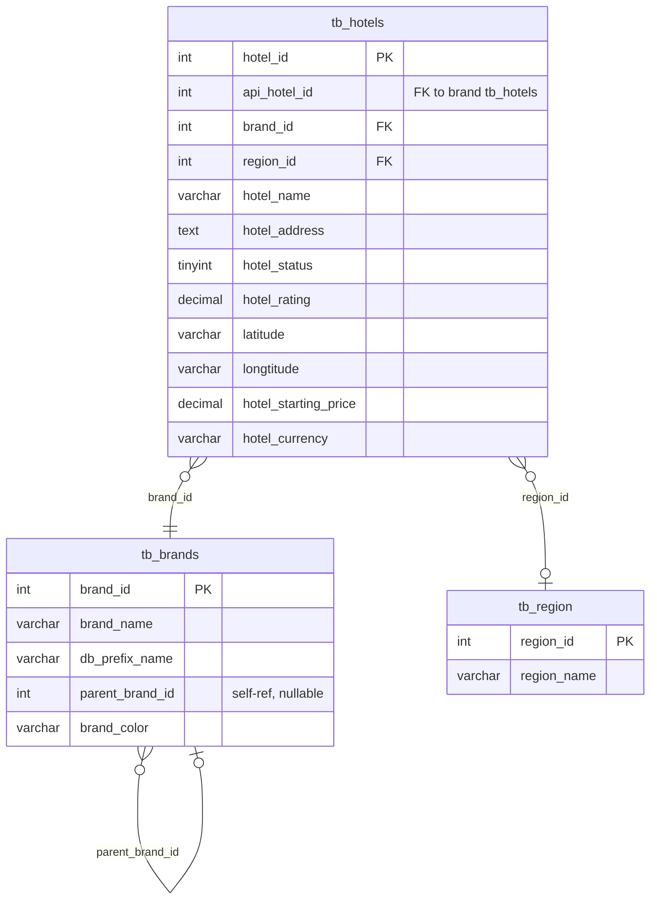
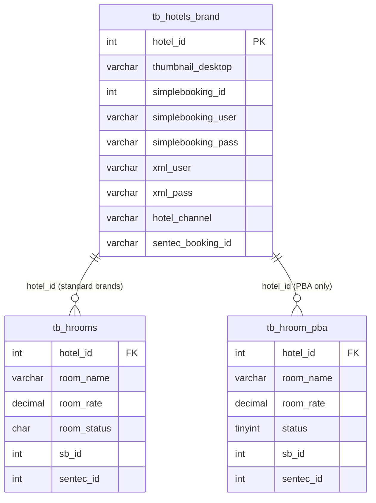

# Data Model

This document explains the database schema and Go data structures used by the archipelago-hotels-mcp server.

## Overview

The server spans two tiers of MySQL databases:

- **Central DB** (`db_archipelagowebsite`) — the hotel catalog, shared across all brands. Contains every hotel record, brand metadata, and regional groupings.
- **Per-brand DBs** — one database per brand group, storing room types and booking engine credentials for hotels belonging to that brand.

Data from both tiers is joined at the application layer, not via database cross-joins.

---

## Central DB: `db_archipelagowebsite`

### Tables

#### `tb_hotels`

The primary hotel catalog. One row per property.

| Column | Type | Notes |
|---|---|---|
| `hotel_id` | INT PK | Central, authoritative hotel identifier |
| `api_hotel_id` | INT NULL | Foreign key into the brand DB's `tb_hotels.hotel_id`; NULL if not yet linked |
| `brand_id` | INT FK | References `tb_brands.brand_id` |
| `region_id` | INT FK | References `tb_region.region_id` |
| `hotel_name` | VARCHAR | Display name |
| `hotel_address` | TEXT | Street address; also searched when filtering by city |
| `hotel_status` | TINYINT | `1` = active; all queries filter `hotel_status = 1` |
| `hotel_rating` | DECIMAL | Guest rating (0–10 scale); used to derive star count when no star column exists |
| `latitude` | VARCHAR | Stored as string; parsed to float64 at scan time |
| `longtitude` | VARCHAR | Intentional legacy typo in schema; parsed to float64 at scan time |
| `hotel_starting_price` | DECIMAL | Last-resort price fallback (rate chain step 3) |
| `hotel_currency` | VARCHAR | Raw ISO 4217 code (e.g. `IDR`, `USD`); passed through to the UI unchanged |

> **Note on `latitude`/`longtitude`:** The misspelling `longtitude` exists in the live schema. The Go code references this column name exactly.

> **Note on star rating:** A dedicated `hotel_stars` column does not exist in the schema. The `Stars` field in `HotelRow` is derived at scan time from `hotel_rating` using threshold rules (≥9.0 → 5 stars, ≥8.0 → 4, etc.).

#### `tb_brands`

Brand catalog. Maps brand names to the per-brand database prefix used to build the DB connection string.

| Column | Type | Notes |
|---|---|---|
| `brand_id` | INT PK | |
| `brand_name` | VARCHAR | Display name (e.g. `Aston`, `Harper`, `favehotels`) |
| `db_prefix_name` | VARCHAR NULL | Prefix used to derive the brand DB name (e.g. `aston` → `db_astonwebsite`) |
| `parent_brand_id` | INT NULL | For sub-brands; the parent's `db_prefix_name` is used instead |
| `brand_color` | VARCHAR NULL | Hex color for UI cards |

Brand-to-database name resolution follows this logic in `connectBrand`:

1. Check the static override map (`favehotel` → `db_favewebsite`, `pba` → `db_pba`).
2. Otherwise, derive: `db_` + prefix + `website` (e.g. `aston` → `db_astonwebsite`).

For sub-brands, `BrandPrefix()` walks the `parent_brand_id` chain once to find the owning prefix.

#### `tb_region`

Geographic groupings used for city-level filtering.

| Column | Type | Notes |
|---|---|---|
| `region_id` | INT PK | |
| `region_name` | VARCHAR | City or region display name (e.g. `Jakarta`, `Bali`) |

#### `tb_hotel_rates` (starting price fallback)

The column `hotel_starting_price` on `tb_hotels` serves as the last-resort price. There is no separate `tb_hotel_rates` table; the rate is denormalised onto the hotel row itself.

### Central DB ER Diagram



---

## Per-Brand DBs

Each brand group has its own MySQL database. The server connects lazily — the connection is established only when a tool handler first requests data for that brand.

### Brand-to-DB Prefix Mapping

| Brand name(s) | `db_prefix_name` | Actual DB name |
|---|---|---|
| Aston, Grand Aston | `aston` | `db_astonwebsite` |
| Hotel Neo | `neo` | `db_neowebsite` |
| favehotels | `favehotel` | `db_favewebsite` (override) |
| The Alana | `alana` | `db_alanawebsite` |
| Harper | `harper` | `db_harperwebsite` |
| Kamuela Villas | `kamuela` | `db_kamuelawebsite` |
| Quest | `quest` | `db_questwebsite` |
| PBA (Powered By Archi) | `pba` | `db_pba` (override) |

Sub-brands (e.g. Grand Aston has `parent_brand_id` pointing to Aston) resolve to the parent's prefix.

### Tables

#### `tb_hotels` (brand DB)

A subset of hotel attributes maintained per-brand. The `hotel_id` here is the **brand-local** ID — it corresponds to `tb_hotels.api_hotel_id` in the central DB.

| Column | Type | Notes |
|---|---|---|
| `hotel_id` | INT PK | Brand-local ID; equals `api_hotel_id` in central DB |
| `thumbnail_desktop` | VARCHAR NULL | CDN URL for the hotel card image (not present in all brands) |
| `simplebooking_id` | INT NULL | SimpleBooking hotel code |
| `simplebooking_user` | VARCHAR NULL | SB XML agent username |
| `simplebooking_pass` | VARCHAR NULL | SB XML agent password |
| `xml_user` | VARCHAR NULL | Alternative XML user |
| `xml_pass` | VARCHAR NULL | Alternative XML password |
| `hotel_channel` | VARCHAR NULL | Distribution channel identifier |
| `sentec_booking_id` | VARCHAR NULL | Sentec booking engine ID (reserved) |

> **Column variability:** Not every brand DB has every column. The server uses `INFORMATION_SCHEMA.COLUMNS` on first connect to build a presence map and constructs queries dynamically via `HasColumn()`.

#### `tb_hrooms` (standard room table)

Used by all brands except PBA.

| Column | Type | Notes |
|---|---|---|
| `hotel_id` | INT FK | References brand `tb_hotels.hotel_id` |
| `room_name` | VARCHAR | Display name |
| `room_rate` | DECIMAL or INT | Stored rate; column type varies by brand — the scan logic retries as INT on conversion failure |
| `room_status` | CHAR | `'Y'` = active; filter: `room_status = 'Y'` |
| `sb_id` | INT NULL | SimpleBooking room code, used to match live rates |
| `sentec_id` | INT NULL | Sentec room ID (reserved) |

#### `tb_hroom` (PBA only)

PBA uses a singular table name and different status semantics.

| Column | Type | Notes |
|---|---|---|
| `hotel_id` | INT FK | |
| `room_name` | VARCHAR | |
| `room_rate` | DECIMAL or INT | |
| `status` | TINYINT | `1` = active (integer, not `'Y'`); filter: `status = 1` |
| `sb_id` | INT NULL | |
| `sentec_id` | INT NULL | |

### Per-Brand DB ER Diagram



> `tb_hroom_pba` is the actual table name `tb_hroom` in the PBA database; shown separately here to illustrate the schema divergence.

---

## Primary Key Mapping: Central → Brand

The central DB and brand DBs use independent auto-increment primary keys. The bridge is `api_hotel_id`:

```
central db_archipelagowebsite          brand db (e.g. db_astonwebsite)
─────────────────────────────          ───────────────────────────────
tb_hotels.hotel_id      (e.g. 42)      tb_hotels.hotel_id  (e.g. 7)
tb_hotels.api_hotel_id  = 7   ─────────────────────────────────────►
```

When a tool handler needs room data or credentials for a hotel:

1. Look up `hotel_id` in the central DB — this is what the MCP tools receive as input.
2. Read `api_hotel_id` from the central row — this is the key used in all brand DB queries.
3. Read `db_prefix_name` from the joined `tb_brands` row — this identifies which brand DB to connect to.

If `api_hotel_id` is NULL the hotel has no brand DB linkage; rate lookups fall back immediately to `hotel_starting_price`.

---

## Column Inconsistency Problem and INFORMATION_SCHEMA Solution

Brand databases were created and extended independently over time. As a result:

- Some brands have `room_rate`; others do not.
- Some have `sb_id` and `sentec_id`; others do not.
- Some have `thumbnail_desktop` on `tb_hotels`; others do not.
- The `room_rate` column is DECIMAL in some brands and INT in others.
- PBA diverges on table name (`tb_hroom`), status column name (`status`), and status value (`1` vs `'Y'`).

**Solution:** On first connection to each brand DB, `scanColumns` queries `INFORMATION_SCHEMA.COLUMNS`:

```sql
SELECT TABLE_NAME, COLUMN_NAME
FROM INFORMATION_SCHEMA.COLUMNS
WHERE TABLE_SCHEMA = (SELECT DATABASE())
  AND TABLE_NAME IN ('tb_hotels', 'tb_hrooms', 'tb_hroom')
```

Results are stored in `Pool.brandCols` as a three-level map:

```
brandCols[prefix][table][column] = true
```

Query builders then call `HasColumn(prefix, table, column)` to decide which columns to include. Missing columns are replaced with literal SQL defaults (`0`, `NULL`, `'Y'`), keeping the scanned column count constant so that `Scan()` always receives the same number of destinations.

The INT/DECIMAL ambiguity for `room_rate` is handled at scan time in `scanRoom`: if the first scan attempt fails with a type conversion error, it retries scanning into `sql.NullInt64`.

---

## Go Structs

### `BrandRow`

Populated from `tb_brands` at startup and cached in `Pool.brands`.

```go
type BrandRow struct {
    BrandID       int
    BrandName     string
    DBPrefixName  string
    ParentBrandID int
    BrandColor    string
}
```

### `HotelRow`

Populated from a JOIN of `tb_hotels`, `tb_brands`, and `tb_region` in the central DB. This is the primary transfer object between the repository layer and tool handlers.

```go
type HotelRow struct {
    HotelID       int
    APIHotelID    sql.NullInt64  // NULL means no brand DB linkage
    BrandID       int
    BrandName     string
    DBPrefix      string         // from tb_brands.db_prefix_name
    RegionName    string
    Name          string
    Address       string
    Rating        float64
    Stars         int            // derived from Rating; not a DB column
    Latitude      float64        // parsed from VARCHAR
    Longitude     float64        // parsed from VARCHAR longtitude
    StartingPrice float64
    Currency      string         // raw code, e.g. "IDR"
    ImageStyle    string         // Tailwind gradient class, derived from BrandName
    BrandColor    string
}
```

`APIHotelID` uses `sql.NullInt64` because the column is nullable. All brand DB operations guard on `APIHotelID.Valid` before proceeding.

`Stars` and `ImageStyle` are never read from the database; they are computed in `scanHotel` after the SQL scan.

### `RoomRow`

One row from `tb_hrooms` or `tb_hroom` (PBA).

```go
type RoomRow struct {
    Name     string
    Rate     float64        // from room_rate; 0 if column absent
    SBID     sql.NullInt64  // SimpleBooking room code for rate matching
    Status   string         // 'Y' (standard) or '1' (PBA), normalised to string
    SentecID sql.NullInt64  // reserved
}
```

### `BrandCredentials`

Booking engine credentials read from the brand DB's `tb_hotels` row. All fields are optional — the set of available columns is discovered at runtime via `HasColumn`.

```go
type BrandCredentials struct {
    SimpleBookingID   int
    SimpleBookingUser string
    SimpleBookingPass string
    XMLUser           string
    XMLPass           string
    HotelChannel      string
    SentecBookingID   sql.NullString  // reserved
}
```

---

## Currency Field

`hotel_currency` in `tb_hotels` stores the raw ISO 4217 currency code (e.g. `IDR`, `USD`, `SGD`). The server does not translate this to a symbol or apply any formatting. The raw code is:

1. Scanned into `HotelRow.Currency`.
2. Passed through to the MCP tool response JSON as the `currency` field.
3. Consumed by the TypeScript frontend, which calls `toLocaleString('id-ID', { style: 'currency', currency: code })` to produce locale-aware formatted output (e.g. `Rp 500.000` for IDR).

The default when the column is NULL is `'IDR'` (applied via `COALESCE` in all hotel SELECT queries).

---

## Thumbnail Field

`thumbnail_desktop` in the brand DB's `tb_hotels` stores a CDN URL pointing to an image hosted on Sentinel Tech's asset infrastructure. The URL is transformed before being returned to clients:

**Raw CDN URL example:**
```
https://sentineltech.s3.amazonaws.com/astonwebsite/images/hotel-abc/thumb.jpg
```

**After `resizeImageURL` transformation:**
```
https://images.archipelagohotels.com/sentineltech-publicwebsite/astonwebsite/images/hotel-abc/thumb.jpg
```

The transformation:

1. Extracts the subdomain from the original URL to determine the S3 bucket name. If the subdomain is `sentineltech`, the bucket name is hardcoded to `sentineltech-publicwebsite`; otherwise it is the second segment of the subdomain.
2. Strips the original host prefix from the URL path.
3. Prepends the image resizer base URL (`https://images.archipelagohotels.com/` by default, overridable via `url_image_resizer` env var) and the bucket name.
4. Optionally appends `?d=WxH&location=center` query parameters for server-side resizing (not used for card thumbnails, which pass `width=0, height=0`).

This is a pure string transformation — no HTTP request is made. The purpose is to route all image traffic through the Archipelago image proxy domain, which is the only external host permitted by the MCP App's Content Security Policy (`resourceDomains: ["images.archipelagohotels.com"]`).

Thumbnails are fetched in parallel per brand prefix in `GetThumbnails`, gated on `HasColumn(prefix, "tb_hotels", "thumbnail_desktop")` to skip brands where the column does not exist.
