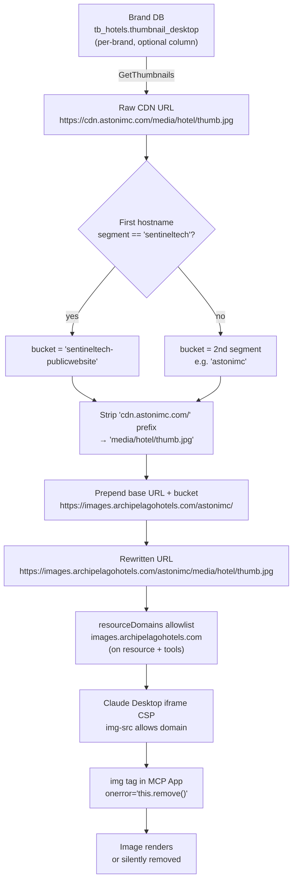

# Image Pipeline: Thumbnail URL Rewriting

This document explains the end-to-end flow for hotel thumbnail images — from where URLs are stored, through why the raw CDN URLs are unusable, to the pure-string rewrite that solves the problem without any server-side HTTP requests.

---

## 1. Source: `thumbnail_desktop` in Brand Databases

Hotel thumbnail URLs are stored in the `thumbnail_desktop` column of the `tb_hotels` table in each brand's database. Not every brand database has this column — it is an optional column that only exists for brands where Sentec PMS has configured image hosting.

`GetThumbnails` checks for the column before querying:

```go
// internal/repository/hotel.go
if db == nil || !p.HasColumn(prefix, "tb_hotels", "thumbnail_desktop") {
    return
}
```

Each brand has its own database (identified by `DBPrefix`), so `GetThumbnails` fans out in parallel goroutines — one per brand prefix present in the hotel list — and collects results into a central map keyed by `hotel_id`.

---

## 2. CDN URLs: Brand-Hosted on Third-Party Domains

The URLs retrieved from `thumbnail_desktop` point to brand CDNs. These are domains operated by Sentec Tech or brand-specific hosting, for example:

| Brand | Example CDN domain |
|-------|-------------------|
| Aston / Astonimc | `cdn.astonimc.com` |
| Sentec platform assets | `sentineltech.com` |
| Other Sentec brands | `storage.astonwebsite.com`, `cdn.harperhotel.com`, etc. |

A raw URL looks like:

```
https://cdn.astonimc.com/media/hotel/aston-jakarta-thumbnail.jpg
```

---

## 3. Why CDN URLs Are Blocked

The MCP App UI is rendered inside an `<iframe>` managed by Claude Desktop. Claude Desktop enforces a strict Content Security Policy (CSP) on that iframe. The CSP `img-src` directive only allows images from origins explicitly declared by the MCP server via `resourceDomains`. Third-party CDN domains (`*.sentineltech.com`, `*.astonimc.com`, etc.) are not on that allowlist and will be blocked by the browser's CSP enforcement — the images simply do not load.

The server has no ability to relax or override the iframe CSP; that is controlled by the Claude Desktop host process.

---

## 4. The `resizeImageURL` Function

`resizeImageURL` is a **pure string transformation** — no HTTP requests, no DNS lookups, no network I/O. It rewrites a brand CDN URL into an equivalent URL on `images.archipelagohotels.com`, Archipelago's own image resizer service.

The function is ported from `ResizeImage` in the production Sentec PMS codebase.

### Source

```go
// internal/repository/hotel.go

func resizeImageURL(img string, width, height int, location string) string {
    if img == "" {
        return ""
    }
    urlImage := os.Getenv("url_image_resizer")
    if urlImage == "" {
        urlImage = "https://images.archipelagohotels.com/"
    }
    bucketName := ""
    r := regexp.MustCompile(`^(?:https?://)?(?:www\.)?([^/]+)`)
    matches := r.FindStringSubmatch(img)
    if len(matches) >= 2 {
        urls := strings.Split(matches[1], ".")
        if urls[0] == "sentineltech" {
            bucketName = "sentineltech-publicwebsite"
        } else if len(urls) >= 2 {
            bucketName = urls[1]
        }
    }
    baseURL := urlImage + bucketName + "/"
    cdn := strings.Split(img, ".")
    if len(cdn) < 2 {
        return img
    }
    trim := strings.Replace(img, cdn[0]+"."+cdn[1]+"."+"com/", "", 1)
    // ... assemble with optional ?s= / ?d= / ?location= params
}
```

### Step-by-step transformation

**Input:**
```
https://cdn.astonimc.com/media/hotel/aston-jakarta-thumbnail.jpg
```

**Step 1 — Extract domain, derive bucket name.**

The hostname is `cdn.astonimc.com`. Split on `.` gives `["cdn", "astonimc", "com"]`. The first segment is not `"sentineltech"`, so bucket name = second segment = `"astonimc"`.

Special case: if the first segment is `"sentineltech"` (i.e. the hostname is `sentineltech.com` or `sentineltech.net`), bucket name is hardcoded to `"sentineltech-publicwebsite"`. This reflects the actual bucket name used in the Archipelago image resizer for Sentec platform assets.

**Step 2 — Strip the `subdomain.domain.com/` prefix from the URL.**

```
cdn.astonimc.com/  →  (removed)
remaining path: media/hotel/aston-jakarta-thumbnail.jpg
```

The strip is: `strings.Replace(img, cdn[0]+"."+cdn[1]+".com/", "", 1)` — removes the first occurrence of `"cdn.astonimc.com/"` from the full URL string.

**Step 3 — Prepend base URL + bucket.**

```
https://images.archipelagohotels.com/astonimc/
```

**Output:**
```
https://images.archipelagohotels.com/astonimc/media/hotel/aston-jakarta-thumbnail.jpg
```

### Resize query parameters

When called with `width=0, height=0` (as is the case for dashboard thumbnail cards), no query parameters are appended. When dimensions are provided:

| Width | Height | Query param |
|-------|--------|-------------|
| 0 | 0 | none |
| W | 0 | `?s=W&location=center` |
| 0 | H | `?location=center` |
| W | H | `?d=WxH&location=center` |

### Base URL override

The resizer base URL defaults to `https://images.archipelagohotels.com/` and can be overridden via the `url_image_resizer` environment variable. This is used in staging and local development environments that proxy to a different image resizer instance.

---

## 5. The `resourceDomains` Allowlist

For the rewritten URLs to load in the iframe, `images.archipelagohotels.com` must be declared in the MCP server's metadata so the Claude Desktop host adds it to the iframe's CSP `img-src`.

This declaration must appear in **two places**:

**On the MCP resource** (`internal/resources/dashboard.go`):
```go
s.AddResource(&mcp.Resource{
    URI:      ResourceURI,
    MIMEType: "text/html;profile=mcp-app",
    Meta: mcp.Meta{
        "ui": map[string]any{
            "resourceDomains": []string{"images.archipelagohotels.com"},
        },
    },
}, ...)
```

**On every tool that returns thumbnails** (e.g. `internal/tools/search.go`, `internal/tools/dashboard.go`):
```go
Meta: mcp.Meta{
    "ui": map[string]any{
        "resourceUri":     resources.ResourceURI,
        "resourceDomains": []string{"images.archipelagohotels.com"},
    },
},
```

The Claude Desktop MCP Apps spec requires `resourceDomains` on both the resource definition and any tool that triggers rendering of that resource. If it is only on the resource, image loads from tool-result renders are still blocked.

---

## 6. Silent Fallback: `onerror="this.remove()"`

In the UI (`ui/src/mcp-app.ts`), every `` tag for a thumbnail includes an inline error handler:

```html

```

If the image resizer is unavailable, returns a 404, or the URL transformation produced an invalid path, the image element is silently removed from the DOM. The card continues to render with its brand gradient background. There is no broken-image icon and no console error visible to the user.

The same pattern is applied to the hotel detail overlay hero image.

---

## 7. Why Not Base64 Proxying

An earlier implementation (`fetchAsDataURI`) fetched each CDN image server-side over HTTP and returned it as a base64 data URI embedded in the tool response. It was replaced for three reasons:

**SSRF risk.** The server was making outbound HTTP requests to arbitrary URLs sourced directly from the brand database, with no allowlist, no redirect limit, and no private-IP rejection. Any URL stored in `thumbnail_desktop` — including internal network addresses — would be fetched.

**Memory pressure.** Base64 encoding adds ~33% overhead. At 50 hotels with images averaging 200 KB each, a single tool response would carry ~13 MB of encoded image data. This exceeds practical MCP message size limits and adds substantial serialization cost.

**stdio incompatibility.** When launched by Claude Desktop, the server runs in stdio mode with no HTTP listener. A proxy endpoint (`/img?url=...`) does not exist in that mode. The pure string transform works identically in both stdio and HTTP modes because it makes no network calls.

---

## 8. URL Transformation Diagram



---

## Summary

| Stage | What happens | Where |
|-------|-------------|-------|
| Query | `thumbnail_desktop` read per-brand in parallel | `repository/hotel.go: GetThumbnails` |
| Rewrite | Pure string transform, no HTTP | `repository/hotel.go: resizeImageURL` |
| CSP allowlist | `resourceDomains` on resource + tools | `resources/dashboard.go`, tool files |
| Fallback | `onerror="this.remove()"` drops broken images | `ui/src/mcp-app.ts` |
| Override | `url_image_resizer` env var for non-prod | `repository/hotel.go: resizeImageURL` |
