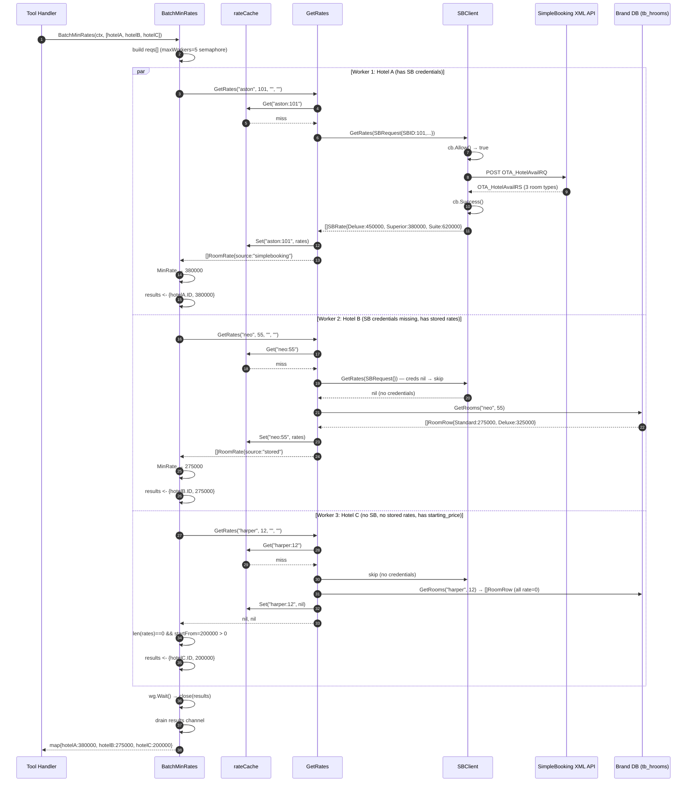

# Rate Fallback Strategy

> **Type**: Explanation (Diátaxis — understanding-oriented)
> **Audience**: Engineers working on pricing, booking integration, or performance tuning
> **Last reviewed**: 2026-06-22

---

## Table of Contents

1. [Why multiple rate sources](#1-why-multiple-rate-sources)
2. [SimpleBooking XML API details](#2-simplebooking-xml-api-details)
3. [Circuit breaker rationale](#3-circuit-breaker-rationale)
4. [Rate cache design](#4-rate-cache-design)
5. [BatchMinRates and the worker pool](#5-batchminrates-and-the-worker-pool)
6. [Fallback to starting_price](#6-fallback-to-starting_price)
7. [Full sequence diagram: BatchMinRates for 3 hotels](#7-full-sequence-diagram-batchminrates-for-3-hotels)
8. [Date handling in get_hotel_detail](#8-date-handling-in-get_hotel_detail)

---

## 1. Why multiple rate sources

Not every Archipelago hotel uses the same booking engine, and not every booking engine is reliably available at query time.

| Source | When available | Data freshness |
|--------|---------------|----------------|
| SimpleBooking live XML API | Hotel has `simplebooking_id`, `xml_user`, `xml_pass` in brand DB; circuit breaker closed | Real-time: prices reflect current availability and promotions |
| Sentec REST API | Hotel has `hotel_channel = 'SENTEC'` and `sentec_booking_id` in brand DB | Real-time: prices from the Sentec Booking Engine |
| Stored `tb_hrooms.room_rate` | Hotel has rows in brand DB with `room_rate > 0` | Stale: updated manually or by a nightly sync job; may be months old |
| `hotel_starting_price` (central DB) | Always: every hotel has this column | Indicative: a marketing "from" price, not an actual bookable rate |

The fallback chain exists because the MCP tools must return _some_ price for every hotel. A hotel card with no price is useless to the model and the user. The chain degrades gracefully: live rates when possible, stale rates when the API is unavailable, indicative price as a last resort.

---

## 2. SimpleBooking XML API details

SimpleBooking is a third-party channel manager used by several Archipelago brands. It exposes a SOAP-style XML API at:

```
https://xml.simplebooking.it/xmlservice.asmx/HotelAvailRQ
```

### Request format

The server sends an `OTA_HotelAvailRQ` document (OpenTravel Alliance format, version 1.0). The relevant structure:

```xml
<?xml version="1.0" encoding="utf-8"?>
<OTA_HotelAvailRQ PrimaryLangID="EN"
    xmlns="http://www.opentravel.org/OTA/2003/05"
    Target="Production" Version="1.0">
  <AvailRequestSegments>
    <AvailRequestSegment>
      <StayDateRange Start="2026-06-22" End="2026-06-23"/>
      <RoomStayCandidates>
        <RoomStayCandidate>
          <GuestCounts>
            <GuestCount AgeQualifyingCode="10.AQC" Count="2"/>
          </GuestCounts>
        </RoomStayCandidate>
      </RoomStayCandidates>
      <TPA_Extensions>
        <provider Name="Xmsfttgad33" Pwd="XMLfegg423!.33"/>
        <XMLHotelAgent Name="{hotel_xml_user}" Pwd="{hotel_xml_pass}"/>
        <Filter HotelCode="{simplebooking_id}"/>
      </TPA_Extensions>
    </AvailRequestSegment>
  </AvailRequestSegments>
</OTA_HotelAvailRQ>
```

Key fields:

- `StayDateRange` — check-in and check-out dates (defaults to today/tomorrow if the caller passes empty strings)
- `GuestCount AgeQualifyingCode="10.AQC" Count="2"` — 2 adults; hardcoded because the MCP tools do not collect guest count
- `provider` — a shared Archipelago-level credential used by SimpleBooking to identify the channel
- `XMLHotelAgent` — per-hotel credentials fetched from the brand DB (`tb_hotels.xml_user`, `tb_hotels.xml_pass`)
- `Filter HotelCode` — the hotel's SimpleBooking ID (`tb_hotels.simplebooking_id`)

The credentials are looked up from the brand DB via `Pool.GetCredentials(ctx, prefix, apiHotelID)` before each call. If the brand DB is unavailable or the hotel has no SimpleBooking credentials, `trySB` returns nil without attempting the API call.

### Response parsing

The response is an `OTA_HotelAvailRS` document. The Go structs mirror the XML structure:

```
OTA_HotelAvailRS
  └── RoomStays
        └── RoomStay[]
              └── RoomRates
                    └── RoomRate[]
                          └── Rates
                                └── Rate[]
                                      ├── Base  AmountAfterTax="350000"
                                      └── Total AmountAfterTax="385000"
```

`Base.AmountAfterTax` is the per-night room rate after tax. `Total.AmountAfterTax` is the total for the stay. The server exposes both: `RoomRate.BaseRate` (nightly) and `RoomRate.RatePerNight` (which is set from `Total` so it can be used as a comparable "price for tonight" figure).

The XML namespace handling is intentionally blunt: all `xmlns` attributes are stripped with a regex before unmarshalling. Go's `encoding/xml` does not handle default namespace declarations well, and stripping them is simpler than a custom decoder.

---

## 3. Circuit breaker rationale

Every call to the SimpleBooking API crosses the public internet with a 10-second timeout. When SimpleBooking is degraded, each failed request blocks a goroutine for 10 seconds. On a hotel list page with 50 hotels and 5 concurrent workers, a fully open API means 10 sequential batches of 5 × 10s = up to 100 seconds of wall-clock time before all goroutines give up.

The circuit breaker prevents this cascade.

### State machine

```
Closed (normal)
  failures < maxFailures (5)
  All API calls proceed.

  ↓ 5th failure in any window

Open
  time.Since(lastFailure) < cooldown (120s)
  All calls return immediately with error "circuit breaker open".
  No network I/O. No goroutine blocking.

  ↓ 120 seconds after lastFailure

  Next Allow() call resets state to Closed, failures = 0.
  (Half-open state is implicit: the first call after cooldown is attempted.)

  ↓ that call succeeds

Closed (recovered)
  Success() sets failures = 0.
```

### Why 5 failures and 120 seconds

These are empirical values ported from the PHP implementation. Five failures correspond to a full BatchMinRates worker pool encountering errors simultaneously — a signal that the API is genuinely down rather than intermittently slow. 120 seconds matches SimpleBooking's typical restart or recovery window observed in production.

### What "success" means

`Success()` resets `failures` to zero. A single successful call fully re-closes the breaker. This is intentional: if SimpleBooking recovers, the server should resume live rates immediately for subsequent requests rather than waiting for a sliding window to drain.

### Goroutine safety

The circuit breaker uses a `sync.Mutex`. `Allow()`, `Failure()`, and `Success()` are all lock-guarded. The lock is per-`SBClient` instance, and there is exactly one `SBClient` per `rate.Service`. This means all brands share a single circuit breaker — if SimpleBooking is down for one hotel, it is treated as down for all. This is correct: the issue is always the shared endpoint, not a per-hotel credential problem.

---

## 4. Rate cache design

`rateCache` is a plain in-memory map with a TTL, protected by a `sync.RWMutex`.

### Key structure

```
key = dbPrefix + ":" + apiHotelID + ":" + checkIn + ":" + checkOut
```

Examples: `"aston:1042:2026-06-23:2026-06-24"`, `"neo:87:2026-06-23:2026-06-24"`. The key includes stay dates so that calls for different date ranges do not share a cache slot. Date normalisation (empty string → today/tomorrow) runs **before** the cache lookup, so omitting dates and passing the same explicit date produce the same key.

### TTL: 5 minutes

Rate data changes infrequently within a session (promotions are set by revenue managers, not by the second), but it should not be served stale indefinitely. Five minutes is a balance between:

- Avoiding repeated XML API calls on hotel list pages (which may show the same hotel in multiple searches within a session)
- Ensuring rates are reasonably fresh if a user asks about prices repeatedly

The TTL is set in `rate.New()`:

```go
cache: newRateCache(5 * time.Minute)
```

### Lazy expiry

Expired entries are removed when they are first read, not by a background goroutine:

```go
func (c *rateCache) Get(key string) ([]RoomRate, bool) {
    c.mu.RLock()
    entry, ok := c.items[key]
    c.mu.RUnlock()
    if !ok {
        return nil, false
    }
    if time.Now().After(entry.expiresAt) {
        c.mu.Lock()
        delete(c.items, key)
        c.mu.Unlock()
        return nil, false
    }
    return entry.rates, true
}
```

This avoids a background ticker goroutine and the associated lifecycle complexity. The trade-off is that stale entries accumulate until re-queried. In practice, the cache holds at most ~50 entries (one per active hotel), so memory impact is negligible.

### Caching nil

When all rate sources fail, `GetRates` caches `nil`:

```go
// 3. No rates found. Cache empty to avoid repeated lookups.
s.cache.Set(key, nil)
return nil, nil
```

A nil entry is a valid cache hit. The next call within 5 minutes will find the key, return `nil, true`, and skip the API call entirely. This is important for hotels that have no rates at all — without it, every `BatchMinRates` call would hammer the API and the brand DB for them.

---

## 5. BatchMinRates and the worker pool

`BatchMinRates` is the function called by all four MCP tool handlers when assembling a list of hotels. It fetches one minimum rate per hotel and returns a `map[hotelID]float64`.

### Why a bounded pool

Without a bound, 50 hotels would spawn 50 goroutines simultaneously. Each goroutine may make a SimpleBooking HTTP call (10s timeout) and a brand DB query. 50 concurrent HTTP calls to a single external endpoint would:

1. Likely trigger rate limiting or timeouts on SimpleBooking's side.
2. Saturate the server's outbound connection pool.
3. Create bursts of 50 brand DB connections.

A semaphore channel of capacity 5 enforces at most 5 concurrent workers:

```go
const maxWorkers = 5
sem := make(chan struct{}, maxWorkers)

for _, r := range reqs {
    wg.Add(1)
    select {
    case sem <- struct{}{}:        // acquire slot (blocks if 5 already running)
    case <-ctx.Done():             // context cancelled — skip this hotel
        wg.Done()
        continue
    }
    go func(r rateReq) {
        defer wg.Done()
        defer func() { <-sem }()  // release slot when done
        // ... fetch rates ...
    }(r)
}
```

### Why 5 workers

Five is an empirical value. With ~50 hotels in a typical list, 5 workers process 10 sequential batches. Each batch hits the cache first; cache misses trigger API calls. In testing, 5 workers balance throughput (the whole list resolves in ~10s under normal conditions) against external API load.

A future tuning point: if the rate cache hit ratio is high (most requests are re-queries within 5 minutes), raising `maxWorkers` to 10 would have no material impact on the API and would halve cold-start latency.

### Context cancellation

If the request context is cancelled (Claude Desktop closed, timeout exceeded), the `select` on `sem <- struct{}{}` falls through to `<-ctx.Done()`, and remaining hotels are skipped. Already-running goroutines receive the cancellation signal on their own `ctx` parameter passed into `GetRates`. This ensures the server does not continue burning resources after a request is abandoned.

### Result collection

Results are sent to a buffered channel of capacity `len(reqs)`. A separate goroutine waits for `wg.Wait()` and then closes the channel. The main goroutine collects from the channel until it is closed:

```go
go func() { wg.Wait(); close(results) }()

m := make(map[int]float64, len(reqs))
for r := range results {
    m[r.hotelID] = r.minRate
}
```

Hotels with no rate (all sources failed, no `starting_price`) produce no entry in the result map. Callers treat a missing entry as "no price available".

---

## 6. Fallback to starting_price

`starting_price` is a column on `tb_hotels` in the central database. It is a marketing "from" price set by the revenue team — not a live availability rate. It is denominated in the hotel's `hotel_currency` (also from the central DB).

The fallback is handled in `BatchMinRates`, not in `GetRates`. This separation is intentional:

- `GetRates` knows about rate sources (SimpleBooking, stored rooms). It does not know about the hotel catalog.
- `BatchMinRates` knows about both: it has the full `HotelRow` (which includes `StartingPrice`) and the rate service.

```go
rates, err := s.GetRates(ctx, r.dbPrefix, r.apiID, "", "")
if err != nil || len(rates) == 0 {
    if r.startFrom > 0 {
        results <- result{r.hotelID, r.startFrom}
    }
    return
}
if m := MinRate(rates); m > 0 {
    results <- result{r.hotelID, m}
} else if r.startFrom > 0 {
    results <- result{r.hotelID, r.startFrom}
}
```

`starting_price` is used when:
- The hotel has no SimpleBooking credentials.
- The brand DB is unreachable.
- The circuit breaker is open.
- All stored room rates are zero.

It is never cached by `rateCache` because it comes from the central DB and is already available in the `HotelRow` loaded by `SearchHotels`. There is no additional I/O cost.

---

## 7. Full sequence diagram: BatchMinRates for 3 hotels

This diagram shows a call with 3 hotels: Hotel A has live SimpleBooking rates, Hotel B has only stored rates, Hotel C has only `starting_price`.



---

## 8. Date handling in get_hotel_detail

`get_hotel_detail` accepts optional `checkIn` and `checkOut` parameters (`YYYY-MM-DD`). When omitted or empty, `GetRates` substitutes today and tomorrow:

```go
if checkIn == "" || checkOut == "" {
    now := s.timeNow()
    checkIn  = now.Format("2006-01-02")
    checkOut = now.Add(24 * time.Hour).Format("2006-01-02")
}
```

Date normalisation runs **before** the cache lookup, so a call with no dates and a call with today's explicit date string produce the same cache key and share a cached result.

The list tools (`search_hotels`, `recommend_hotel`, `find_hotels`) do not accept date parameters. Rates in list results always reflect a one-night stay starting tonight. This is acceptable for discovery and recommendation use cases, where prices are tier indicators rather than exact booking quotes. The `source` field on each `RoomRate` lets the caller qualify the figure appropriately.
