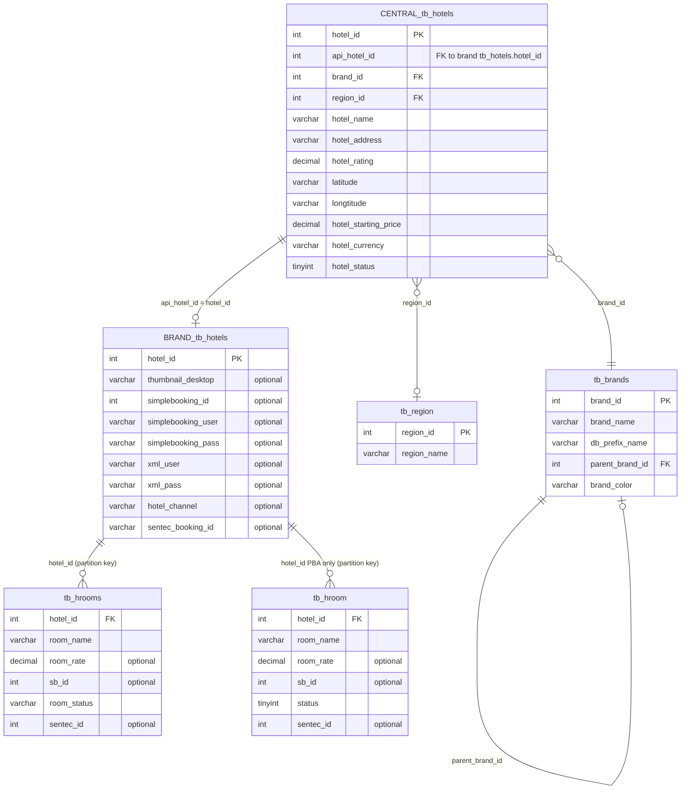

# Database Schema Reference

The MCP server connects to two categories of MySQL database: one central database shared across all brands and one database per brand.

---

## Central Database: `db_archipelagowebsite`

Contains the master hotel catalog, brand definitions, and region lookup. The Pool connects to this database on startup using `MYSQL_DB` (default `db_archipelagowebsite`).

### `tb_hotels`

Master hotel registry. One row per property.

| Column | Type | Notes |
|---|---|---|
| `hotel_id` | INT PK | Central primary key used by all MCP tools |
| `api_hotel_id` | INT NULL | Foreign key into each brand's `tb_hotels.hotel_id`. NULL for hotels not yet linked to a brand DB. |
| `brand_id` | INT FK | References `tb_brands.brand_id` |
| `region_id` | INT FK | References `tb_region.region_id` |
| `hotel_name` | VARCHAR | Display name |
| `hotel_address` | VARCHAR | Free-text address including city/province |
| `hotel_rating` | DECIMAL | Guest score (0–10). Stars are derived from this at runtime: ≥9→5★, ≥8→4★, ≥7→3★, ≥6→2★, else 1★ |
| `latitude` | VARCHAR | Stored as a string; parsed to float64 at read time |
| `longtitude` | VARCHAR | Note: column name in production schema uses this spelling |
| `hotel_starting_price` | DECIMAL | Lowest published rate in `hotel_currency` |
| `hotel_currency` | VARCHAR | ISO 4217 code, default `IDR` |
| `hotel_status` | TINYINT | `1` = active. All queries filter `WHERE hotel_status = 1`. |

### `tb_brands`

Brand definitions. Drives which per-brand database to connect to.

| Column | Type | Notes |
|---|---|---|
| `brand_id` | INT PK | |
| `brand_name` | VARCHAR | Display name (e.g. `Aston`, `favehotels`, `Quest`) |
| `db_prefix_name` | VARCHAR NULL | Prefix used to derive the brand DB name: `db_{prefix}website`. Exceptions: `favehotel` → `db_favewebsite`, `pba` → `db_pba`. |
| `parent_brand_id` | INT NULL | Sub-brands point to their parent. The pool resolves the parent's `db_prefix_name` when looking up the brand DB. |
| `brand_color` | VARCHAR NULL | Hex color used in dashboard card headers |

### `tb_region`

Region/city lookup for hotel search filters.

| Column | Type | Notes |
|---|---|---|
| `region_id` | INT PK | |
| `region_name` | VARCHAR | City or island name used in search (`LIKE` match) |

---

## Per-Brand Databases: `db_{prefix}website`

Each brand has its own MySQL database. The pool connects lazily on first request and caches the connection. Brand DB names follow the pattern `db_{db_prefix_name}website` with two known exceptions:

| `db_prefix_name` | Actual DB name |
|---|---|
| `favehotel` | `db_favewebsite` |
| `pba` | `db_pba` |
| _(all others)_ | `db_{prefix}website` |

### `tb_hotels` (brand DB)

Brand-specific hotel attributes. `hotel_id` here corresponds to `api_hotel_id` in the central `tb_hotels`.

| Column | Type | Notes |
|---|---|---|
| `hotel_id` | INT PK | Matches `tb_hotels.api_hotel_id` in the central DB |
| `thumbnail_desktop` | VARCHAR NULL | **Optional column** — not present in all brand schemas. Always checked via `HasColumn()` before access. CDN URL rewritten through `url_image_resizer` at read time. |
| `simplebooking_id` | INT NULL | SimpleBooking hotel code. Optional — checked via `HasColumn()`. |
| `simplebooking_user` | VARCHAR NULL | XML agent username for SimpleBooking API. Optional. |
| `simplebooking_pass` | VARCHAR NULL | XML agent password for SimpleBooking API. Optional. |
| `xml_user` | VARCHAR NULL | Alternative XML credentials username. Optional. |
| `xml_pass` | VARCHAR NULL | Alternative XML credentials password. Optional. |
| `hotel_channel` | VARCHAR NULL | Booking engine identifier (`SB` = SimpleBooking, `SENTEC` = Sentec Booking Engine). Optional. |
| `sentec_booking_id` | VARCHAR NULL | Sentec Booking Engine property ID passed as `property_id` in availability search requests (`hotel_channel = 'SENTEC'`). Optional. |

All credential columns are discovered at connection time via `INFORMATION_SCHEMA.COLUMNS` and accessed only if present. This makes the server forward-compatible when columns are added to brand schemas incrementally.

### `tb_hrooms` (standard brands)

Room types for most brands. Filtered by `hotel_id = api_hotel_id` and `room_status = 'Y'`.

| Column | Type | Notes |
|---|---|---|
| `hotel_id` | INT FK | Matches `api_hotel_id` in central DB. **Must always be included in WHERE clause** — tables may be logically partitioned by hotel. |
| `room_name` | VARCHAR | Room type display name |
| `room_rate` | DECIMAL or INT NULL | Published nightly rate. Optional — some schemas omit it. Column type varies by brand (DECIMAL or INT); scan code handles both. |
| `sb_id` | INT NULL | SimpleBooking room type ID. Optional. |
| `room_status` | VARCHAR | `Y` = active. Default filter value. |
| `sentec_id` | INT NULL | Sentec room type ID; matched against `sentecRate.RoomID` when merging Sentec API results into room types. Optional. |

### `tb_hroom` (PBA brand only)

PBA uses a different table name and status column convention.

| Column | Type | Notes |
|---|---|---|
| `hotel_id` | INT FK | Same partitioning requirement as `tb_hrooms` |
| `room_name` | VARCHAR | |
| `room_rate` | DECIMAL or INT NULL | Optional |
| `sb_id` | INT NULL | Optional |
| `status` | TINYINT | `1` = active (differs from `tb_hrooms.room_status = 'Y'`) |
| `sentec_id` | INT NULL | Optional |

### `credential_booking_engines` (select brand DBs)

Stores booking engine API credentials keyed by `code`. Present in `db_astonwebsite`, `db_alanawebsite`, and `db_pba`; absent from other brand databases. The rate service queries this table for `code = 'SENTEC'` to obtain per-brand Sentec credentials before falling back to the `SENTEC_USER`/`SENTEC_PASS` environment variables.

| Column | Type | Notes |
|---|---|---|
| `credential_id` | INT PK | |
| `code` | VARCHAR | Booking engine identifier, e.g. `SENTEC` |
| `username` | VARCHAR | API username |
| `password` | VARCHAR | API password |
| `status` | TINYINT | `1` = active. Only rows with `status = 1` are used. |

Query: `SELECT username, password FROM credential_booking_engines WHERE code = 'SENTEC' AND status = 1 LIMIT 1`

If the table does not exist (MySQL error 1146) or has no active SENTEC row, the call returns empty strings and the caller falls back to environment variables.

---

## Partition Filtering

Per-brand tables (`tb_hotels`, `tb_hrooms`, `tb_hroom`) are logically partitioned by `hotel_id`. Every query against a brand DB **must** include an explicit `WHERE hotel_id = ?` predicate. Without it the query scans all partitions and returns rows for all hotels in that brand, which is both incorrect and expensive.

The `GetRooms` and `GetCredentials` functions always bind `apiHotelID` in the WHERE clause. When writing new queries against brand DBs, this is mandatory.

---

## Optional Column Discovery

Because brand databases were deployed at different times with different schema versions, several columns are optional. On first connection to each brand DB the pool runs a single `INFORMATION_SCHEMA.COLUMNS` query against `tb_hotels`, `tb_hrooms`, and `tb_hroom` and caches the result in memory. Call `HasColumn(prefix, table, column)` before referencing any column that may not exist:

```go
if p.HasColumn(prefix, "tb_hotels", "thumbnail_desktop") {
    // safe to SELECT thumbnail_desktop
}
```

Columns verified via `HasColumn()` at runtime:

- `tb_hotels`: `thumbnail_desktop`, `simplebooking_id`, `simplebooking_user`, `simplebooking_pass`, `xml_user`, `xml_pass`, `hotel_channel`, `sentec_booking_id`
- `tb_hrooms` / `tb_hroom`: `room_rate`, `sb_id`, `room_status` / `status`, `sentec_id`

---

## Entity Relationship Diagram



---

## Key Identifiers

| Identifier | Where stored | What it identifies |
|---|---|---|
| `hotel_id` (central) | `db_archipelagowebsite.tb_hotels.hotel_id` | Stable MCP-facing hotel key. Used in all tool responses. |
| `api_hotel_id` (central) | `db_archipelagowebsite.tb_hotels.api_hotel_id` | Foreign key into brand DB `tb_hotels.hotel_id`. The bridge between central and per-brand data. |
| `simplebooking_id` (brand) | brand `tb_hotels.simplebooking_id` | Hotel code for SimpleBooking OTA availability API (`<Filter HotelCode="..."/>`). |
| `sb_id` (brand rooms) | brand `tb_hrooms.sb_id` | Room type code for SimpleBooking. |
| `sentec_id` (brand rooms) | brand `tb_hrooms.sentec_id` | Room type code for Sentec Booking Engine; matched against `sentecRate.RoomID` when merging Sentec API results into room types. |
| `sentec_booking_id` (brand) | brand `tb_hotels.sentec_booking_id` | Property ID passed as `property_id` in Sentec availability search requests. |
