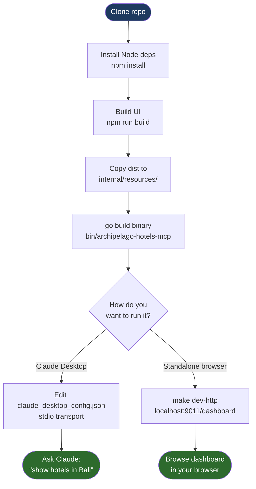

# Getting Started with Archipelago Hotels MCP

This tutorial walks a new developer through cloning the repository, building the server, wiring it into Claude Desktop, and running your first query. Budget about 20 minutes.

---

## Prerequisites

| Tool | Minimum version | Why |
|---|---|---|
| Go | 1.25 | The module requires `go 1.25.0` in `go.mod` |
| Node.js | 18 | Vite is used to build the embedded MCP App UI |
| MySQL | 8.0 | The central catalog database is `db_archipelagowebsite` |
| Claude Desktop | latest | Required to test the MCP integration |
| make | any | Build orchestration |

Verify your tools before continuing:

```bash
go version        # go1.25.x or later
node --version    # v18.x or later
npm --version     # bundled with Node.js
mysql --version   # 8.0.x or later
```

---

## Development Setup Flow



---

## 1. Clone and Project Structure

```bash
git clone https://github.com/msw/archipelago-hotels-mcp.git
cd archipelago-hotels-mcp
```

The repository layout:

```
archipelago-hotels-mcp/
├── cmd/
│   └── archipelago-hotels-mcp/
│       └── main.go          # Binary entry point; parses stdio|http subcommand
├── internal/
│   ├── repository/          # MySQL pool, hotel/room queries, ConfigFromEnv()
│   ├── rate/                # Live rate fetching (Sentec API, SimpleBooking fallback)
│   ├── resources/           # Embedded MCP App HTML (written here by build-ui)
│   │   └── mcp-app.html     # Generated — do not edit by hand
│   ├── server/              # MCP server wiring (stdio and HTTP transports)
│   └── tools/               # MCP tool handlers: search, detail, recommend, dashboard
├── ui/                      # Vite/vanilla-JS MCP App source
│   ├── index.html
│   └── dist/                # Generated by npm run build
├── docs/                    # Documentation (ADRs, how-tos, reference, tutorials)
├── Makefile
├── go.mod
└── go.sum
```

Key relationships to understand on day one:

- `internal/resources/mcp-app.html` is the compiled, single-file UI that gets embedded into the Go binary via `//go:embed`. The `build-ui` make target produces it. **Never edit this file directly.**
- The binary accepts exactly two subcommands: `stdio` (for Claude Desktop) and `http` (for standalone or agent use).
- Database connections are lazy: the central `db_archipelagowebsite` is opened at startup; per-brand databases are opened on first use. A missing database causes degraded mode, not a crash.

---

## 2. Environment Setup

The server is configured entirely through environment variables. There is no config file parsed at runtime.

Copy the example file and fill in your values:

```bash
cp docs/how-to/configure-env.md /dev/null   # just for reference — see below
```

Create a `.env` file in the project root (never commit this):

```dotenv
# .env — local development
MYSQL_HOST=127.0.0.1
MYSQL_PORT=3306
MYSQL_USER=archipelago_ro
MYSQL_PASS=your_password_here
MYSQL_DB=db_archipelagowebsite

# Set to 1 for SQL query logging, cache events, and rate API traces
DEBUG=0

# Image CDN proxy — must end with a trailing slash.
# Set to empty string to skip URL rewriting and return raw DB image URLs.
url_image_resizer=https://images.archipelagohotels.com/
```

> **Note on `url_image_resizer` casing.** This variable is lowercase by design — it matches the legacy PHP/CMS convention from which the image URL scheme was inherited. The Go server reads it with `os.Getenv("url_image_resizer")`. The exact casing must be preserved.

Load the variables into your shell for the current session:

```bash
set -a && source .env && set +a
```

Or export them individually:

```bash
export MYSQL_HOST=127.0.0.1
export MYSQL_PORT=3306
export MYSQL_USER=archipelago_ro
export MYSQL_PASS=your_password_here
export MYSQL_DB=db_archipelagowebsite
export url_image_resizer=https://images.archipelagohotels.com/
```

### Variable reference

| Variable | Default | Purpose |
|---|---|---|
| `MYSQL_HOST` | `127.0.0.1` | MySQL hostname or IP |
| `MYSQL_PORT` | `3306` | MySQL port |
| `MYSQL_USER` | `root` | MySQL login user |
| `MYSQL_PASS` | _(empty)_ | MySQL login password |
| `MYSQL_DB` | `db_archipelagowebsite` | Central catalog database |
| `DEBUG` | `0` | Set `1` for debug-level logging to stderr |
| `url_image_resizer` | `https://images.archipelagohotels.com/` | Image CDN proxy base URL |

---

## 3. Build

The full build runs in two stages managed by `make build`:

```bash
make build
```

What happens, in order:

```
=== Building MCP App UI ===
  cd ui && npm install --silent    # installs Vite and dependencies
  npm run build                    # Vite bundles ui/index.html → ui/dist/index.html
  cp ui/dist/index.html internal/resources/mcp-app.html   # embed target written

=== Building archipelago-hotels-mcp binary ===
  go build -o bin/archipelago-hotels-mcp ./cmd/archipelago-hotels-mcp
  # The Go compiler embeds internal/resources/mcp-app.html via //go:embed

=== Build complete ===
  bin/archipelago-hotels-mcp   ~15MB
```

The result is a **single self-contained binary** at `bin/archipelago-hotels-mcp`. It contains the UI, all Go dependencies, and no external runtime requirements beyond a reachable MySQL server.

### Faster rebuilds (Go only)

When you are iterating on Go code and have not changed the UI:

```bash
make build-fast   # skips npm install + Vite build, reuses existing mcp-app.html
```

### Other make targets

```bash
make lint         # go vet ./...
make install      # go install — copies binary to $GOPATH/bin
make clean        # removes bin/, ui/dist/, ui/node_modules/, go build cache
make help         # prints all targets
```

---

## 4. Configure Claude Desktop

Claude Desktop spawns the MCP server as a subprocess using the `stdio` transport. It does not use your shell's `PATH`, so the full path to the binary is required.

Find the binary path:

```bash
pwd  # note your project root
# The binary is at: <project-root>/bin/archipelago-hotels-mcp
```

Edit the Claude Desktop config file:

- **macOS:** `~/Library/Application Support/Claude/claude_desktop_config.json`
- **Windows:** `%APPDATA%\Claude\claude_desktop_config.json`
- **Linux:** `~/.config/Claude/claude_desktop_config.json`

Add the `archipelago-hotels` entry to the `mcpServers` object:

```json
{
  "mcpServers": {
    "archipelago-hotels": {
      "command": "/Users/your-username/projects/archipelago-hotels-mcp/bin/archipelago-hotels-mcp",
      "args": ["stdio"],
      "env": {
        "MYSQL_HOST": "127.0.0.1",
        "MYSQL_PORT": "3306",
        "MYSQL_USER": "archipelago_ro",
        "MYSQL_PASS": "your_password_here",
        "MYSQL_DB": "db_archipelagowebsite",
        "url_image_resizer": "https://images.archipelagohotels.com/",
        "DEBUG": "0"
      }
    }
  }
}
```

Replace the `command` value with the absolute path to the binary you just built. Use `make install` if you prefer to place it in `$GOPATH/bin`:

```bash
make install
# Binary is now at: $(go env GOPATH)/bin/archipelago-hotels-mcp
go env GOPATH   # prints the path to use in command above
```

After saving the config, **restart Claude Desktop** to pick up the new server.

> **Security note.** Passwords in `claude_desktop_config.json` are stored in plaintext. On macOS, consider using a wrapper shell script that reads the password from Keychain instead. See `docs/how-to/configure-env.md` for a worked example.

---

## 5. First Test: Ask Claude About Hotels in Bali

Open a new Claude Desktop conversation and type:

```
show hotels in Bali
```

What you should see:

1. Claude calls the `search_hotels` MCP tool with `city=Bali`.
2. The tool returns hotel data and an MCP App payload.
3. Claude Desktop renders an interactive UI panel showing hotel cards with names, thumbnails, star ratings, and starting prices.
4. You can click a hotel card in the panel to fetch full details (room types, amenities, rates).

If the panel does not appear, check the troubleshooting section at the bottom of this document.

Other prompts to try:

```
what Aston hotels are available in Jakarta?
recommend a hotel near Seminyak beach
show me room details for The Alana Yogyakarta
```

---

## 6. Standalone Mode (HTTP Dashboard)

You can browse hotel data directly in a browser without Claude Desktop using the built-in HTTP server and dashboard UI.

```bash
make dev-http
```

This builds the binary (Go only, fast) and starts:

```
bin/archipelago-hotels-mcp http -addr :9011 -verbose
```

Open your browser at:

```
http://localhost:9011/dashboard
```

The dashboard provides a filterable grid of hotels by city, brand, and region. It queries the same database and rate sources as the MCP tools.

Additional HTTP endpoints available in this mode:

| Endpoint | Purpose |
|---|---|
| `GET /api/hotels?city=Bali` | JSON hotel list with optional `city` and `brand` filters |
| `GET /api/brands` | JSON list of all hotel brands |
| `GET /api/regions` | JSON list of all regions |
| `GET /health` | Server health and DB connection status |
| `POST /mcp` | MCP Streamable HTTP transport (for agent integrations) |

Stop the server with `Ctrl-C`.

---

## 7. Common First-Run Issues

### Database not reachable — degraded mode

**Symptom:** The server starts and logs:

```
level=WARN msg="starting in DEGRADED mode — database unavailable"
```

Claude Desktop shows an error when you ask about hotels, or returns empty results.

**Cause:** The server cannot connect to MySQL with the credentials in your environment.

**Fix:**

```bash
# 1. Verify MySQL is running
mysql -h 127.0.0.1 -P 3306 -u archipelago_ro -p -e "SELECT 1"

# 2. Confirm the database exists
mysql -h 127.0.0.1 -u archipelago_ro -p -e "SHOW DATABASES LIKE 'db_archipelagowebsite'"

# 3. Check your env vars are actually set
echo $MYSQL_HOST $MYSQL_PORT $MYSQL_USER $MYSQL_DB

# 4. Enable debug logging for more detail
DEBUG=1 ./bin/archipelago-hotels-mcp stdio
```

The server deliberately starts in degraded mode rather than refusing to start so that MCP tool registration still works — only queries fail. This is by design (see ADR-0002).

### No hotel thumbnails — `url_image_resizer` missing or wrong

**Symptom:** Hotel cards appear in the MCP panel but images are broken or absent.

**Cause:** `url_image_resizer` is not set, is set to an empty string, or points to a URL that is unreachable from your browser.

**Fix:**

```bash
# Check the variable is exported with a trailing slash
echo $url_image_resizer
# Expected: https://images.archipelagohotels.com/

# For local development without CDN access, set to empty to return raw DB URLs
export url_image_resizer=
```

Note that the server does **not** fetch images itself — it rewrites the URL string and the browser fetches the image. If raw DB URLs work in your browser but the rewritten URLs do not, the CDN proxy may be unreachable from your network.

### MCP server not appearing in Claude Desktop

**Symptom:** No hotel-related tools appear when you ask Claude about hotels.

**Checklist:**

1. The `command` path in `claude_desktop_config.json` points to the binary that was actually built (`make build` completed without errors).
2. The binary is executable: `ls -l bin/archipelago-hotels-mcp` should show `-rwxr-xr-x`.
3. Claude Desktop was restarted after editing the config file.
4. The JSON in `claude_desktop_config.json` is valid — use `python3 -m json.tool < ~/Library/Application\ Support/Claude/claude_desktop_config.json` to validate.

### Build fails: `npm: command not found`

Node.js is not installed or not on your `PATH`. Install it from [nodejs.org](https://nodejs.org) (v18 LTS or later) and confirm with `node --version`.

### Build fails: `go: go.mod requires go >= 1.25`

Your Go installation is older than 1.25. Download the current release from [go.dev/dl](https://go.dev/dl) and confirm with `go version`.

---

## Next Steps

- `docs/tutorials/add-tool.md` — add a new MCP tool to the server
- `docs/how-to/configure-env.md` — full environment variable reference with Docker and staging examples
- `docs/explanation/architecture.md` — how the MCP, rate, and repository layers fit together
- `docs/reference/tools.md` — complete reference for all MCP tool schemas and parameters
