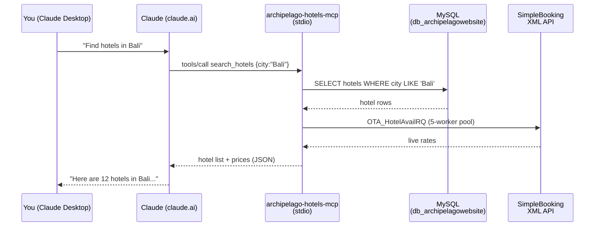

# Get Started with Archipelago Hotels MCP

This tutorial walks you through building and running the Archipelago Hotels MCP server from source,
connecting it to Claude Desktop, and running your first hotel searches.
You will have a working server by the end.

> **What you will build**
> A Go MCP server that gives Claude access to 279+ hotels across 13 Archipelago brands — searchable
> by city, brand, budget, and vibe — with live room rates and an embedded visual dashboard.

---

## Contents

1. [Prerequisites](#1-prerequisites)
2. [Clone and build](#2-clone-and-build)
3. [Configure environment variables](#3-configure-environment-variables)
4. [Run on stdio — connect to Claude Desktop](#4-run-on-stdio--connect-to-claude-desktop)
5. [Run on HTTP — test with curl](#5-run-on-http--test-with-curl)
6. [Your first hotel search](#6-your-first-hotel-search)
7. [Explore the visual dashboard](#7-explore-the-visual-dashboard)
8. [Common pitfalls](#8-common-pitfalls)
9. [Next steps](#9-next-steps)

---

## 1. Prerequisites

| Requirement | Minimum version | Notes |
|---|---|---|
| Go | 1.22+ | The module itself targets 1.25; any recent toolchain works |
| Node.js | 18+ | Required only for `make build-ui`; skip if you use `make build-fast` |
| npm | 9+ | Bundled with Node 18 |
| MySQL | 5.7+ / 8.0 | Access to `db_archipelagowebsite` and per-brand databases |
| Claude Desktop | Latest | For the stdio integration |
| Git | Any | For cloning |

Verify your Go installation:

```bash
go version
# go version go1.25.0 darwin/arm64  (or newer)
```

> **No database yet?**
> You can still build and start the server. It starts in *degraded mode* (no hotel data returned)
> and prints a warning. The HTTP health endpoint will still respond.

---

## 2. Clone and build

```bash
# Clone the repository
git clone https://github.com/msw/archipelago-hotels-mcp.git
cd archipelago-hotels-mcp
```

### Full build (UI + binary)

This compiles the TypeScript dashboard and embeds it into the Go binary:

```bash
make build
```

Expected output:

```
=== Building MCP App UI ===
UI built: ui/dist/index.html
UI embedded at: internal/resources/mcp-app.html
=== Building archipelago-hotels-mcp binary ===
Binary: bin/archipelago-hotels-mcp
=== Build complete ===
-rwxr-xr-x  1 user  staff  18M bin/archipelago-hotels-mcp
```

### Fast build (Go only, skip UI)

Use this when you have not changed the UI and want a quick rebuild:

```bash
make build-fast
```

### Verify the binary

```bash
./bin/archipelago-hotels-mcp
```

Expected output (usage help printed to stderr):

```
Archipelago Hotels MCP Server — search and explore hotels across Archipelago brands.

Usage:
  archipelago-hotels-mcp stdio
  archipelago-hotels-mcp http
  archipelago-hotels-mcp http -addr :PORT
  archipelago-hotels-mcp http -verbose
```

---

## 3. Configure environment variables

The server reads all configuration from environment variables at startup. There is no config file.

Create a `.env` file in the project root (this file is not loaded automatically — source it or
export the variables in your shell before running):

```bash
# .env.example — copy to .env and fill in your values

# --- MySQL connection ---
MYSQL_HOST=127.0.0.1          # MySQL server host
MYSQL_PORT=3306               # MySQL server port
MYSQL_USER=archipelago        # MySQL user with SELECT access
MYSQL_PASS=your_password_here # MySQL password (empty = no password)
MYSQL_DB=db_archipelagowebsite # Central database name — do not change

# --- Debug logging ---
DEBUG=0                       # Set to 1 to enable verbose slog output on stderr

# --- Image CDN ---
url_image_resizer=https://images.archipelagohotels.com/
# Controls the base URL used to rewrite hotel thumbnail paths for CSP-safe delivery.
# Only change this if you are running behind a local image proxy.
```

Copy and source it:

```bash
cp .env.example .env
# Edit .env with your actual credentials, then:
export $(grep -v '^#' .env | xargs)
```

### Required database access

The server requires two levels of MySQL access:

| Database | Purpose |
|---|---|
| `db_archipelagowebsite` | Central catalog: hotels, brands, regions |
| `db_aston`, `db_neo`, `db_fave`, `db_alana`, `db_harper`, `db_kamuela`, `db_quest`, `db_pba` | Per-brand room types and rates (lazy-connected) |

A single MySQL user with `SELECT` privileges on all these databases is sufficient for read-only
operation.

---

## 4. Run on stdio — connect to Claude Desktop

The stdio transport is used by Claude Desktop. Claude launches the binary as a child process and
communicates with it over stdin/stdout following the MCP protocol.

### Architecture



### Step 1 — Find the absolute path to your binary

```bash
pwd
# /Users/you/archipelago-hotels-mcp

echo "$(pwd)/bin/archipelago-hotels-mcp"
# /Users/you/archipelago-hotels-mcp/bin/archipelago-hotels-mcp
```

### Step 2 — Edit claude_desktop_config.json

Open the Claude Desktop configuration file:

| Platform | Path |
|---|---|
| macOS | `~/Library/Application Support/Claude/claude_desktop_config.json` |
| Windows | `%APPDATA%\Claude\claude_desktop_config.json` |
| Linux | `~/.config/Claude/claude_desktop_config.json` |

Add the `archipelago-hotels` entry to the `mcpServers` object:

```json
{
  "mcpServers": {
    "archipelago-hotels": {
      "command": "/Users/you/archipelago-hotels-mcp/bin/archipelago-hotels-mcp",
      "args": ["stdio"],
      "env": {
        "MYSQL_HOST": "127.0.0.1",
        "MYSQL_PORT": "3306",
        "MYSQL_USER": "archipelago",
        "MYSQL_PASS": "your_password_here",
        "MYSQL_DB": "db_archipelagowebsite",
        "DEBUG": "0"
      }
    }
  }
}
```

> Replace `/Users/you/archipelago-hotels-mcp` with the actual absolute path from Step 1.
> Relative paths do not work in Claude Desktop.

### Step 3 — Restart Claude Desktop

Quit and reopen Claude Desktop. When a new conversation starts, you should see the MCP tools
icon (hammer) in the input area. Hover over it to confirm `archipelago-hotels` is listed.

---

## 5. Run on HTTP — test with curl

HTTP mode exposes MCP over Streamable HTTP (POST `/mcp`) plus several REST convenience endpoints.
It is useful for integration testing, CI, and running the server as a background service.

```bash
# Start with debug logging
./bin/archipelago-hotels-mcp http -verbose

# Or via Make
make dev-http
```

Expected startup output:

```
time=2026-06-22T09:00:00Z level=INFO msg="starting HTTP server" addr=:9011
[GIN-debug] POST   /mcp
[GIN-debug] GET    /mcp
[GIN-debug] GET    /dashboard
[GIN-debug] GET    /api/hotels
[GIN-debug] GET    /api/brands
[GIN-debug] GET    /api/regions
[GIN-debug] GET    /health
[GIN-debug] Listening and serving HTTP on :9011
```

### Health check

```bash
curl -s http://localhost:9011/health | jq .
```

```json
{
  "status": "ok",
  "version": "dev",
  "db": "connected"
}
```

If the database is unreachable, `"db"` will read `"degraded"` and the server will still respond
(it returns empty results for tool calls).

### List hotels via REST

```bash
# All hotels
curl -s "http://localhost:9011/api/hotels" | jq '.[0]'

# Filter by city
curl -s "http://localhost:9011/api/hotels?city=Jakarta" | jq 'length'

# Filter by brand
curl -s "http://localhost:9011/api/hotels?brand=harper" | jq '.[].hotel_name'
```

### List brands

```bash
curl -s "http://localhost:9011/api/brands" | jq '.[].brand_name'
```

### Call an MCP tool directly

```bash
curl -s -X POST http://localhost:9011/mcp \
  -H "Content-Type: application/json" \
  -d '{
    "jsonrpc": "2.0",
    "id": 1,
    "method": "tools/call",
    "params": {
      "name": "search_hotels",
      "arguments": {
        "city": "Bali",
        "limit": 3
      }
    }
  }' | jq .
```

---

## 6. Your first hotel search

With Claude Desktop connected, open a new conversation and try these prompts.
Each one exercises a different MCP tool.

### Search by city (`search_hotels`)

> "Find hotels in Bali"

> "Show me hotels in Surabaya"

> "Are there any Archipelago hotels in Singapore?"

Claude calls `search_hotels` with the city you mention, fetches live rates from SimpleBooking
where available, and presents a list with names, locations, brands, and starting prices.

### Get recommendations (`recommend_hotel`)

> "I need a budget-friendly hotel in Yogyakarta for a family trip"

> "What's a good romantic hotel in Lombok under IDR 1,500,000 per night?"

> "Find a business hotel in Jakarta CBD — I need reliable WiFi and meeting rooms"

Claude calls `recommend_hotel`, which ranks hotels by vibe, purpose, and budget alignment.

### Browse all hotels (`find_hotels`)

> "Show me all Harper hotels"

> "List favehotels properties across Indonesia"

> "What Archipelago brands are available in Makassar?"

Claude calls `find_hotels`, which returns a paginated list with optional city/brand filtering.

### Open the dashboard (`find_hotels` with UI)

> "Open the hotel dashboard"

> "Show me the interactive hotel browser"

Claude returns the embedded MCP App resource (the visual dashboard). See the next section
for what to expect.

---

## 7. Explore the visual dashboard

The embedded dashboard is a single-page TypeScript app compiled by Vite and served as an MCP App
resource at `ui://hotel-dashboard` with MIME type `text/html;profile=mcp-app`.

When Claude opens the dashboard you will see:

- **Brand filter bar** — click any brand logo to filter the hotel grid
- **City search** — type a city name to narrow results in real time
- **Hotel cards** — thumbnail, hotel name, city, brand badge, starting price formatted in the
  hotel's local currency (IDR displayed as `Rp 850.000` using Indonesian locale)
- **Click a card** — triggers `get_hotel_detail` (app-only tool) to load full room-type list,
  photos, amenities, and per-room prices

> **Note:** Images load through `images.archipelagohotels.com`. If thumbnails show as broken,
> check the `url_image_resizer` environment variable (see [Common pitfalls](#8-common-pitfalls)).

The dashboard is completely self-contained in the binary — no CDN or internet access required for
the UI itself. Only hotel thumbnails and live rate API calls go outbound.

---

## 8. Common pitfalls

### DB connection refused

**Symptom:** Server starts with `starting in DEGRADED mode — database unavailable`. All tool calls
return empty results or an error message.

**Checks:**

```bash
# Is MySQL running and reachable?
mysql -h "$MYSQL_HOST" -P "$MYSQL_PORT" -u "$MYSQL_USER" -p"$MYSQL_PASS" -e "SELECT 1;"

# Common causes:
# - MYSQL_HOST is "localhost" but MySQL listens on 127.0.0.1 (or vice versa)
# - MySQL port is non-standard (check with: SHOW VARIABLES LIKE 'port';)
# - Firewall blocking the port
# - MySQL user requires SSL (add &tls=skip-verify to DSN if needed)
```

Set `DEBUG=1` to see the full DSN and connection error in the server log.

### No hotels returned

**Symptom:** `search_hotels` or `find_hotels` returns an empty list even though MySQL is connected.

**Checks:**

```bash
# Verify you are connected to the correct central database
mysql -e "SHOW TABLES;" "$MYSQL_DB"
# Must include: tb_hotels, tb_brands, tb_regions

# If MYSQL_DB is wrong, set it explicitly:
export MYSQL_DB=db_archipelagowebsite
```

The most common cause is `MYSQL_DB` pointing at a different database or a per-brand database
instead of the central catalog.

### Images not loading in the dashboard

**Symptom:** Hotel cards show broken image icons.

**Checks:**

```bash
# The default CDN base
echo "${url_image_resizer:-https://images.archipelagohotels.com/}"

# If you are behind a proxy or running in a restricted network, set:
export url_image_resizer=https://your-image-proxy.example.com/
```

Image URLs are rewritten at query time using `resizeImageURL()` in `internal/repository/hotel.go`.
No base64 proxying is used — the browser fetches images directly from the CDN.

### UI not opening after binary update

**Symptom:** The dashboard does not appear, or Claude says the resource is unavailable, after you
rebuilt the binary.

**Fix:** Quit Claude Desktop fully and reopen it. Claude Desktop holds a handle on the server
process. A full restart forces it to re-launch the new binary and re-register all MCP resources.

On macOS, `Cmd+Q` from the menu bar (not just closing the window) is required for a full quit.

### Live rates missing (showing stored or starting price only)

**Symptom:** Room prices shown are lower quality estimates, and `DEBUG=1` logs show circuit breaker
open or SimpleBooking timeouts.

**Background:** The rate service uses a three-level fallback chain:

1. SimpleBooking XML API (live, 5-worker bounded pool, 5-min TTL cache)
2. `tb_hrooms.room_rate` stored in the per-brand database
3. `hotel_starting_price` from the central database

A circuit breaker trips after 5 consecutive SimpleBooking failures and stays open for 120 seconds.
This is expected behaviour if the API is temporarily unreachable. Prices will recover automatically
once the cooldown expires.

---

## 9. Next steps

| Topic | Where to look |
|---|---|
| How-to: add a new MCP tool | `docs/how-to/` |
| Adding a new brand database | `internal/repository/repository.go` — `brandPrefixes` slice |
| Deploying as a systemd service (HTTP mode) | `docs/how-to/` |
| MCP App UI customisation | `ui/src/mcp-app.ts` |
| Rate service configuration (SB credentials) | `internal/repository/room.go` — `GetCredentials` |
| go-sdk MCP documentation | [github.com/modelcontextprotocol/go-sdk](https://github.com/modelcontextprotocol/go-sdk) |
| Archipelago Hotels brand guide | Internal wiki |
| Sentec PMS integration | Reserved — `internal/rate/sentec.go` |
